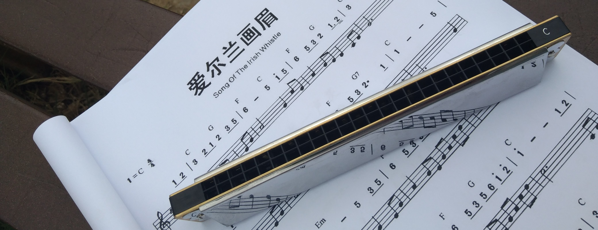

## 关于我

>有很多的绝望，但也有美的时刻，只不过在美的时刻，时间是不同于以往的。 ──《刺猬的优雅》

- **昵称**：中文昵称「**於清樂**」「**二花**」，英文 ID「**ryan4yin**」「**ryan_yin**」
- **音乐**：
  - 喜欢听后摇、蓝草、民谣、器乐
  - 有在断断续续地学习竹笛跟口琴，另外也有在学习使用 [Synthesizer V](https://dreamtonics.com/en/synthesizerv/) 跟 [Reaper](https://www.reaper.fm)
- **其他爱好**：
  - 运动：喜欢轮滑以及游泳，哦还有 VR 游戏《Beat Saber》《Pistol Whip》，但是目前都是半吊子哈哈~
  - 茶：2021 年在朋友家喝过一次青钱柳后就一直年年不忘，年底就入坑了凤牌滇红、天之红祁门红茶、极白安吉白茶，目前比较喜欢喝红茶。
- **书籍**：读得最多的正经书是 IT 技术书籍，另外也喜欢看科幻，以及戒不掉的网文/轻小说
- **影视**：看得最多的是动漫，另外就是欧美科幻片、温情片
- **中文输入方案**：[小鹤音形](https://flypy.com/)
- **专业**：大学学的是声学，没错就是初中物理课上敲音叉的那个声学。本人专业知识战五渣，学位证都没拿到，就不展开了hhh
- **自然语言**
  - **English**: Good at reading technical articles, but weak in writing, listening and speaking
  - **中文**：母语，高中语文中等水准。希望能学会用中文写小说，就先从短篇开始吧
- **编程语言**
  - Python: 目前的主力，也是我最熟悉的语言
  - Go: 学习中，云原生圈子里最流行的语言
  - Rust: 学习中，大量函数式的语法糖，贴心的编译器提示，感觉很好用
  - C: 勉强能看懂代码，荒废比较久了。在学习 Nginx/Linux 的过程中慢慢补吧...
  - 曾经使用过但已经荒废的语言：Java/Julia/Mathematica/Lua
- **职业**：**SRE**
  - 维护与优化容器计算平台及流量链路，分析与管控云计算成本，**稳定高效**地支撑快速成长的业务
- **工具或技术**：Linux/Kubernetes/Istio

## 关于此博客

>“对我来说，博客首先是一种知识管理工具，其次才是传播工具。我的技术文章，主要用来整理我还不懂的知识。我只写那些我还没有完全掌握的东西，那些我精通的东西，往往没有动力写。炫耀从来不是我的动机，好奇才是。"   ──阮一峰


- 2016-06-17：在博客园 - https://www.cnblogs.com/kirito-c/
- 2021-01-16：开设独立博客 https://ryan4yin.space






学习技术时，边学边做笔记是我的个人习惯。
偶尔有些伤春悲秋的想法，也会随便写写吐槽一下，这也是我大学写日记养成的习惯。

最开始是 2016 年 6 月，我开始在「博客园」上写文章。
中间有用过 hexo+next-theme 搭个人博客，但是个人博客没啥流量，它的存在貌似毫无意义，因此域名到期后就没续。

有人阅读我的文章，为它点个赞、分享或者评论交流，我才能感受到自己写的东西是有意义的，因此我又回到了「博客园」。
「博客园」的 SEO 做得很好，「博客园首页」也是一个很好的引流途径，这些结合起来，就能满足我的小小虚荣心。

大概我写的部分文章确实对别人有些价值，因此几年下来在博客园也积累了十多万访问量。

但是 2020 年通过独立博客，见识了各种各样的大佬们。大家的博客，通过一条条友链连接在一起，我觉得这非常有趣。
在这个友链串联起的世界中游览，每次总能有些新的收获。

而且个人博客的主题更丰富多彩，通过 github actions + github pages 来搭博客，也没啥成本。
恰好最近又买了一个域名 `ryan4yin.space`，十年有效期。

于是就有了这个小站。

### 博客内容

我以前用博客园的时候，习惯将它当作笔记本使用，各色各样的笔记都直接往「博客园」里放，方便自己查阅。
偶尔有一两篇自觉写得还不错，对别人可能有帮助的，我会发布到「博客园首页」。

但是这种做法其实不好，笔记主要是给自己看的，写得不一定清楚明白，不适合直接分享出来（网络垃圾制造者...）
应该有专门的地方来放这些东西，所以我现在将所有的个人笔记，都保存在了 [ryan4yin/knowledge](https://github.com/ryan4yin/knowledge) 里面。

而这个独立博客的内容，和 `ryan4yin/knowledge` 应该是相辅相成的。

日常的一些笔记我仍然会记录在 `ryan4yin/knowledge` 里面，然后从中选择部分有意思的笔记，整理润色后，发布到这个博客，和大家分享。

另一方面，博客既是一个发声的地方，我偶尔可能也会发些自己的闲言碎语。

### 注意事项

博客中的内容说到底也只是我一家之言，我只能尽量去减少错漏，但不能保证内容的正确性！

因此请带着批判的眼光看待本博客中的任何内容。

## 画外

互联网浩如烟海，这个小站偏安一隅，如果它有幸被你发现，而且其中文字对你还有些帮助，那可真是太棒了！感谢有你~

