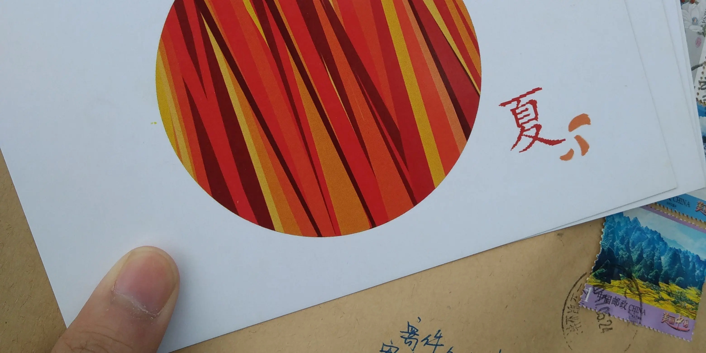



> 感谢 @芝士部落格 提供了友链页面模板~

在友链形成的网络中漫游，是一件很有意思的事情。

**以前的人们通过信笺交流，而我们通过友链串联起一个「世界」。希望你我都能在这个「世界」中有所收获**

**注：** 下方友链次序每次刷新页面随机排列。

<ul id="friendsList"></ul>

## 交换友链

 由于友链数量较多，目前已停止接受友链申请，谢谢！


<!-- 有这么几个前提条件：

1. 博客运行时间超过半年，至少有 6 篇自认为有价值的原创文章。如果这个要求都没达到，我会比较担心你的博客能否长期维护下去。
2. 我希望加我友链的朋友们，愿意做个偶尔互访、互相评论两句的博友。如果你只是想多一个外链优化下 SEO，那恕我谢绝添加。
3. 为了能够做到互访，我希望你的博客内容对我也有些吸引力，比如说技术内容比较有意思，或者是有趣的生活类博客。长期不更新的博客，或者内容质量不高的博客，我也会谢绝添加。

可通过 [Issues](https://github.com/ryan4yin/ryan4yin.space/issues) 或者评论区提交友链申请（**但是请注意，我不保证会通过申请**），格式如下：

    站点名称：This Cute World
    站点地址：https://thiscute.world/
    个人形象：https://thiscute.world/avatar/myself.webp
    站点描述：赞美快乐~  -->

