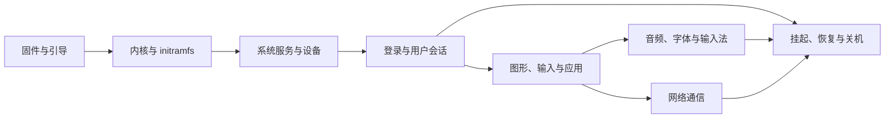

> AI 创作声明：本系列文章使用 gpt-5.6-sol 与 DeepSeek 4.1
> Flash 辅助创作。写作时先查阅上游官方文档，再在本机运行可以安全执行的命令，并结合[作者的 Nix 配置仓库](https://github.com/ryan4yin/nix-config)中的实际案例和独立技术审查交叉核对；无法在当前环境验证的部分会明确注明。

写这个系列时，我已经用了七八年 Linux，但遇到系统的各种大小毛病，还是常常觉得定位跟解决很艰难。知道一堆组件的名字，跟知道它们如何一起工作，中间还差着不少东西。

我想画一幅 Linux 桌面的「解牛图」。就像庖丁解牛那样，能看清骨节筋脉，遇到问题时才知道该从哪里下刀。这个系列面向已经有一定 Linux 桌面使用经验、想继续往下挖的读者，顺着开机、登录、应用运行到关机的过程，解释每一步由谁负责、依赖什么，以及完成后交给谁。

下面这张图先把九篇文章放回同一条生命周期里。箭头表示阅读时最值得追踪的交接关系，并不表示所有工作都严格串行执行。



## 按下电源之后，桌面是怎样出现的

> Linux 桌面不是一个单独的程序，而是固件、内核、系统服务、用户会话、显示服务器和应用共同组成的运行环境。systemd 的
> [bootup 手册](https://github.com/systemd/systemd/blob/main/man/bootup.xml)给出了采用 systemd 时的系统启动关系。

先以一台使用 UEFI、systemd 和 Wayland 的桌面为例。固件完成早期初始化，把控制权交给引导程序；引导程序加载内核与 initramfs。内核启动后，initramfs 里的早期用户空间准备并挂载真正的根文件系统，再交给其中的系统管理器。这里的 initramfs 可以理解为一个临时工作环境：磁盘上的系统还没准备好运行，总得先有人把通向它的路接起来。固件直接加载内核也是可能的，不能把某个引导程序当作所有 Linux 系统的必经之路。这个交接过程见
[systemd 的 bootup 手册](https://github.com/systemd/systemd/blob/main/man/bootup.xml)。

在本系列的环境里，接手的是 systemd 系统实例。它依据单元的依赖和顺序关系安排挂载、服务等工作，许多任务可以并行。因而「开机时间线」只帮助我们理解先决条件，不能理解成每台机器都按一张固定清单逐行启动。`default.target`
是默认启动目标的入口，通常指向 `graphical.target` 或
`multi-user.target`；图形目标也不等于某个用户已经成功进入了桌面。
[bootup 中的系统管理器启动过程](https://github.com/systemd/systemd/blob/main/man/bootup.xml)
给出了这些 target 的关系。

接下来，系统要为特定用户建立登录会话。在使用 `pam_systemd`
的登录流程中，这个 PAM 模块把会话登记到 systemd-logind，并参与准备用户的运行时目录和 systemd 用户实例。用户实例与某一次图形登录不是一回事，同一用户的多个会话可以共用它。这也解释了为什么讨论桌面服务时，经常需要分清「系统实例」和「用户实例」。具体的会话类别和生命周期由
[pam_systemd 手册](https://github.com/systemd/systemd/blob/main/man/pam_systemd.xml)
说明，认证和会话的区别留到登录篇展开。

接着，Wayland 合成器与图形应用建立连接。应用通过 Wayland 协议提交显示内容、接收用户输入，合成器承担显示服务器的角色。Wayland 本身没有一个所有桌面共用的服务器程序，不同桌面使用不同的合成器实现。因此，遇到显示或输入问题，光知道「我用的是 Wayland」还不够，还要知道连接的是哪个合成器、应用实际使用了哪套图形接口。
[Wayland 官方介绍](https://wayland.freedesktop.org/)明确区分了协议、库和具体实现。

窗口显示出来以后，应用还会调用桌面的其他接口。比如一次通过 portal 发起的屏幕共享：应用请求 ScreenCast
portal，桌面对应的后端参与处理请求，随后应用通过 portal 返回的连接读取 PipeWire 中的屏幕流。这个过程同时涉及应用、portal、桌面后端和 PipeWire，只看应用窗口能否显示，自然不足以判断共享链路是否可用。参见
[portal 后端说明](https://flatpak.github.io/xdg-desktop-portal/docs/#backends)和
[ScreenCast 接口](https://flatpak.github.io/xdg-desktop-portal/docs/doc-org.freedesktop.portal.ScreenCast.html)。

音频也有自己的路径。在 PipeWire 中，可以把应用和设备对应的节点想成一组输入口、输出口，声音沿节点之间的连接流动。WirePlumber 这类会话管理器负责设备发现、连接策略等工作，PipeWire 负责运行这张处理图。这里的「会话管理器」是多媒体系统里的角色，不要跟刚才的登录会话管理混淆。[PipeWire 概览](https://docs.pipewire.org/page_overview.html)对两者职责作了区分。

网络从开机时就开始参与其中。systemd-networkd 是系统服务，会在网络设备出现时识别并配置它们；NetworkManager 也是网络管理实现，负责连接和接口配置，并向应用提供 D-Bus 接口。它们做的工作不需要等用户打开浏览器才开始。读网络篇时，我们会顺着设备、地址、路由和名称解析检查应用的通信条件，不把某一个网络管理程序的运行状态等同于整个网络可用。参见
[systemd-networkd 手册](https://github.com/systemd/systemd/blob/main/man/systemd-networkd.service.xml)和
[NetworkManager 手册](https://www.networkmanager.dev/docs/api/latest/NetworkManager.html)。

最后是退出。关机时系统管理器停止服务、卸载文件系统，再完成系统断电；挂起和恢复则由 systemd 的睡眠服务协调。把它们都叫作「关闭桌面」会漏掉后半段的工作。启动时关心某个依赖有没有准备好，退出时则要关心使用它的进程有没有结束、资源能否释放。相关机制分别见
[bootup 的关机说明](https://github.com/systemd/systemd/blob/main/man/bootup.xml)与
[systemd 睡眠服务手册](https://github.com/systemd/systemd/blob/main/man/systemd-suspend.service.xml)。

## 这幅图里，哪些是我的选择

这个系列首先面向想弄清 Linux 桌面工作原理的读者，不要求预先熟悉 NixOS 或 Arch。正文会先讲内核、systemd、Wayland、PipeWire 等上游组件的通用机制，再说明同一机制在 NixOS 和 Arch 中通常从哪里配置。

需要具体配置时，我会以日常使用的 NixOS 桌面为例；网络部分还会涉及 systemd-networkd 与 iwd。这些只是案例环境的选择，不能当作 NixOS 或 Linux 桌面的统一默认值。

NixOS 比较特别的地方是配置入口：先用 NixOS 配置描述期望的系统，再由模块落实成软件包、服务及配置文件。读到一段 Nix 配置时，我建议继续追问它最后影响的是哪一个组件。例如启用某项服务之后，仍要区分声明的配置与正在运行的服务状态。
[NixOS 手册的配置说明](https://nixos.org/manual/nixos/stable/#sec-changing-config)
也明确指出，应用配置可能涉及重启运行中的系统服务。

如果你使用 Arch，可以把相同上游组件的运行机制与本系列对照；Arch 的
[systemd 软件包](https://archlinux.org/packages/core/x86_64/systemd/)来自同一个上游项目，但本文里的 Nix 配置不能直接变成你的配置文件。换成 Fedora、Ubuntu，或者换一个桌面环境，也先确认实际运行的组件与版本，再对应到这幅图上。这里不会用发行版名称替你推断合成器、登录管理器或网络管理程序。

需要引用个人配置时，正文会摘出理解问题所需的最小片段，并附上完整配置链接。案例用于解释上游机制，不要求读者先读懂整个 Nix 仓库。

## 系列阅读路径

九篇文章按系统的生命周期安排。第一次读可以从启动篇往后走；以后只查某个组件，也可以从下面直接进入。D-Bus 等基础概念在系统基础篇集中解释，后续文章再说明具体服务如何使用它。

| 文章                                                                   | 沿着哪一段看                                             |
| ---------------------------------------------------------------------- | -------------------------------------------------------- |
| [（一）系统全景与阅读路径](/posts/linux-desktop-architecture/)（本文） | 把启动、会话、应用和退出连起来                           |
| [（二）从固件到根文件系统](/posts/linux-desktop-boot/)                 | 固件怎样交给内核，系统怎样找到根文件系统                 |
| [（三）系统服务、设备与通信](/posts/linux-desktop-system-foundations/) | systemd 单元、journal、udev 和 D-Bus 怎样支撑后面的桌面  |
| [（四）登录、身份与用户会话](/posts/linux-desktop-login-session/)      | 认证之后怎样建立会话，密钥环、用户实例和设备访问如何衔接 |
| [（五）显示、输入与图形渲染](/posts/linux-desktop-graphics/)           | 输入事件怎样到达应用，应用画面怎样到达屏幕               |
| [（六）桌面应用、portal 与沙盒](/posts/linux-desktop-app-integration/) | 应用如何启动，文件访问和屏幕共享如何跨越桌面接口         |
| [（七）音频、字体与输入法](/posts/linux-desktop-media-input/)          | 声音怎样流动，文字怎样显示，输入法怎样把文字交给应用     |
| [（八）网络如何到达应用](/posts/linux-desktop-network/)                | 设备、地址、路由、DNS 和 VPN/TUN 怎样影响应用通信        |
| [（九）挂起、恢复与关机](/posts/linux-desktop-power/)                  | 系统怎样暂停、回来或退出，哪些资源需要重新准备或释放     |

## 先认清自己正在观察什么

读完整个系列之前，可以先做两个很小的观察练习。以下结果来自笔者的 NixOS
PC。命令适用于安装了 systemd 工具的环境，只读取信息。命令含义见
[systemctl 手册](https://github.com/systemd/systemd/blob/main/man/systemctl.xml)。

先读取磁盘上的默认启动目标：

```console
$ systemctl --root=/ get-default
default.target
```

这里的 `--root=/`
让查询直接查看本机根目录下的单元文件，不依赖与运行中的 systemd 通信。输出说明默认目标的配置，不能证明本次启动已经抵达它，也不能证明图形会话正常。

再分别向系统实例和当前用户实例读取版本属性：

```console
$ systemctl show -p Version
Version=261.1

$ systemctl --user show -p Version
Version=261.1
```

两条命令的区别是查询对象，不是权限高低；`--user`
选择当前用户的服务管理器。若查询成功，版本属性只说明你联系到了哪个版本的管理器，不代表它管理的所有服务都健康。
[systemctl 的实例选择选项](https://github.com/systemd/systemd/blob/main/man/user-system-options.xml)
说明了这一区别。

以后读日志、设备节点或服务状态时，也可以这样问自己：这份输出来自哪个组件？它能证明哪一步发生了？还缺哪一段证据？带着这些问题读[启动篇](/posts/linux-desktop-boot/)，从固件交出控制权的地方开始。

### 顺着交接点继续查

只确认“服务正在运行”，通常还不够。更实用的做法是沿组件之间的交接点走四步：

1. 先确定正在观察哪个组件，以及它属于系统实例还是用户实例。
2. 读取少量、明确的状态字段，不急着翻完整日志。
3. 找到它依赖的上游，或接手工作的下游。
4. 写清当前证据能证明什么，尚未验证什么。

下面以 `graphical.target` 为例。先看目标本身的状态字段：

```console
$ systemctl show graphical.target \
    -p Id -p LoadState -p ActiveState -p SubState
Id=graphical.target
LoadState=loaded
ActiveState=active
SubState=active
```

再看它直接或间接拉入了哪些单元。实际列表可能很长，先用目标名和树形层级判断方向，不必一上来逐个展开：

```console
$ systemctl list-dependencies graphical.target --plain --no-pager
graphical.target
  greetd.service
  multi-user.target
  systemd-user-sessions.service
```

这段经过删减的输出说明笔者的机器用 greetd 提供登录界面，也说明 `graphical.target`
的事务包含哪些依赖，但不能证明登录界面已经可操作，更不能证明某个用户的桌面会话已经建立。其他机器可能使用 GDM、SDDM 等 display
manager，应以本机列表为准。若登录界面有问题，下一步应查看实际的 display
manager 单元；若登录成功后桌面有问题，则应转向用户会话和用户实例。

用户实例也能用同一套方法观察。例如查询自己的默认目标：

```console
$ systemctl --user show default.target \
    -p Id -p LoadState -p ActiveState -p SubState
Id=default.target
LoadState=loaded
ActiveState=active
SubState=active
```

这里的 `default.target`
属于当前用户管理器，和系统实例里的同名目标不是同一个对象。以后遇到“系统服务正常、桌面功能却不可用”的情况，先分清应该查询哪一个管理器，往往能少走很多弯路。
