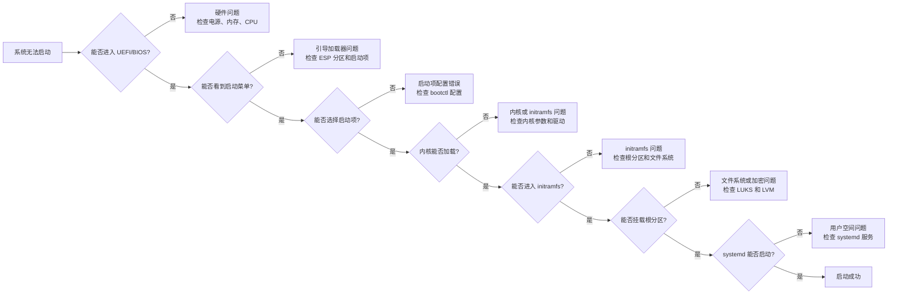

> **AI 创作声明**：本系列文章由笔者借助 ChatGPT, Kimi K2, 豆包和 Cursor 等 AI 工具创作，有
> 很大篇幅的内容完全由 AI 在我的指导下生成。如有错误，还请指正。

## 系统启动与安全框架

本文将简要介绍 Linux 桌面系统的启动机制，从 UEFI 引导到内核加载，从 initramfs 到 systemd
服务启动，再到桌面环境加载。同时还会探讨系统的安全框架，了解 PAM、PolicyKit 等组件如何保护
系统安全。

---

## 1. 系统启动流程

### 启动的四个关键阶段

Linux 桌面系统的启动过程可以分为以下几个主要阶段：

1. **固件阶段**：UEFI 固件初始化硬件
2. **引导加载器阶段**：加载内核和 initramfs
3. **内核阶段**：硬件探测和驱动加载
4. **initramfs 阶段**：准备根文件系统
5. **用户空间阶段**：systemd 接管系统管理

### UEFI：系统启动的起点

现代系统普遍使用 **UEFI 固件** 代替 BIOS。UEFI 初始化硬件后，从 EFI System Partition (ESP)
中加载启动管理器。

NixOS 默认使用 grub，启用 Secure
Boot([lanzaboote](https://github.com/nix-community/lanzaboote)) 时需改用
[systemd-boot](https://www.freedesktop.org/software/systemd/man/latest/systemd-boot.html).

systemd-boot 的全局配置是 `/boot/loader/loader.conf`，具体的启动项配置需要分类讨论：

- **Type 1：手动配置
  （[Boot Loader Specification Type #1](https://uapi-group.org/specifications/specs/boot_loader_specification/#type-1-boot-loader-specification-entries)）**

  - 配置方式：`/loader/entries/*.conf`，位于 EFI 系统分区（ESP）或 Extended Boot Loader
    Partition（XBOOTLDR）下
  - 特点：
    - 可自定义启动项名称、内核参数、initrd 等
    - 描述 Linux 内核及其 initrd，也可以描述任意 EFI 可执行文件
    - 包括 fallback / rescue 内核
  - 示例：

    ```ini
    title   NixOS Linux
    linux   /vmlinuz-linux
    initrd  /initrd-linux.img
    options root=UUID=xxxx rw
    ```

- **Type 2：统一内核镜像
  （[Boot Loader Specification Type #2](https://uapi-group.org/specifications/specs/boot_loader_specification/#type-2-efi-unified-kernel-images)）**

  - 配置方式：将 EFI 格式的 UKI 镜像放在 ESP 分区的 `/EFI/Linux/` 下即可
  - 工作原理：
    1. systemd-boot 在启动时扫描 ESP 的 `/EFI/Linux/` 目录
    2. systemd-boot 会自动将扫描到的内核镜像添加到启动菜单，无需单独的 `.conf` 文件
  - 特点：
    - 免配置，自动出现在启动菜单中
    - vmlinuz-linux, initrd 跟 cmdline 等信息被统一打包成一个 EFI 镜像，一个镜像就包含了系
      统启动需要的所有数据，更方面简洁。

- **其他自动识别的启动项**
  - Microsoft Windows EFI boot manager（如果已安装）
  - Apple macOS boot manager（如果已安装）
  - EFI Shell 可执行文件（如果已安装）
  - 「Reboot Into Firmware Interface」选项（如果 UEFI 固件支持）
  - Secure Boot 变量注册（如果固件处于 setup 模式，且 ESP 提供了相关文件）

**常用命令**：

- `efibootmgr -v`：查看 / 修改固件启动顺序
- `bootctl status`：检查 systemd-boot 安装与 ESP 状态
- `bootctl list`：列出启动条目
- `ukify inspect /boot/EFI/Linux/nixos-xxx.efi`: 查看 efi 镜像中包含的信息

示例：

```bash
# 查看固件启动顺序
$ nix run nixpkgs#efibootmgr -v

BootCurrent: 0000
Timeout: 0 seconds
BootOrder: 0000,0004
Boot0000* NixOS HD(1,GPT,34286f3b-d4df-456d-bf7a-eb67f2bf1a72,0x1000,0x12b000)/EFI\BOOT\BOOTX64.EFI
...
Boot0004* Windows Boot Manager  HD(1,GPT,34286f3b-d4df-456d-bf7a-eb67f2bf1a72,0x1000,0x12b000)/\EFI\Microsoft\Boot\bootmgfw.efi0000424f

# 检查 systemd-boot 安装与 ESP 状态
$ bootctl status

System:
      Firmware: UEFI 2.80 (American Megatrends 5.27)
 Firmware Arch: x64
   Secure Boot: enabled (user)
  TPM2 Support: yes
  Measured UKI: yes
  Boot into FW: supported

Current Boot Loader:
      Product: systemd-boot 257.7
     Features: ✓ Boot counting
               ✓ Menu timeout control
               ✓ One-shot menu timeout control
               ✓ Default entry control
               ✓ One-shot entry control
               ✓ Support for XBOOTLDR partition
               ✓ Support for passing random seed to OS
               ✓ Load drop-in drivers
               ✓ Support Type #1 sort-key field
               ✓ Support @saved pseudo-entry
               ✓ Support Type #1 devicetree field
               ✓ Enroll SecureBoot keys
               ✓ Retain SHIM protocols
               ✓ Menu can be disabled
               ✓ Multi-Profile UKIs are supported
               ✓ Boot loader set partition information
    Partition: /dev/disk/by-partuuid/34286f3b-d4df-456d-bf7a-eb67f2bf1a72
       Loader: └─EFI/BOOT/BOOTX64.EFI
Current Entry: nixos-generation-848-jattq2uvv2snrigcxtdcxelgaawdb3s6lar3ualze77id46h5adq.efi
...
Available Boot Loaders on ESP:
          ESP: /boot (/dev/disk/by-partuuid/34286f3b-d4df-456d-bf7a-eb67f2bf1a72)
         File: ├─/EFI/systemd/systemd-bootx64.efi (systemd-boot 257.7)
               └─/EFI/BOOT/BOOTX64.EFI (systemd-boot 257.7)
...
Default Boot Loader Entry:
         type: Boot Loader Specification Type #2 (.efi)
        title: NixOS Xantusia 25.11.20250830.d7600c7 (Linux 6.16.4) (Generation 848, 2025-09-01)
           id: nixos-generation-848-jattq2uvv2snrigcxtdcxelgaawdb3s6lar3ualze77id46h5adq.efi
       source: /boot//EFI/Linux/nixos-generation-848-jattq2uvv2snrigcxtdcxelgaawdb3s6lar3ualze77id46h5adq.efi (on the EFI System Partition)
     sort-key: lanza
      version: Generation 848, 2025-09-01
        linux: /boot//EFI/Linux/nixos-generation-848-jattq2uvv2snrigcxtdcxelgaawdb3s6lar3ualze77id46h5adq.efi
      options: init=/nix/store/gaj3sp3hrzjhp59bvyxhc8flg5s6iimg-nixos-system-ai-25.11.20250830.d7600c7/init nvidia-drm.fbdev=1 root=fstab loglevel=4 lsm=landlock,yama,bpf nvidia-drm.modeset=1 nvidia-drm.fbdev=1 nvidia.NVreg_PreserveVideoMemoryAllocations=1 nvidia.NVreg_OpenRmEnableUnsupportedGpus=1

# 查看上述启动项中 uki efi 文件的内容
$ nix shell nixpkgs#systemdUkify
$ ukify inspect /boot/EFI/Linux/nixos-generation-848-jattq2uvv2snrigcxtdcxelgaawdb3s6lar3ualze77id46h5adq.efi
.osrel:
  size: 141 bytes
  sha256: e486dea4910eb9262efc47464f533f96093293d37c3d25feb954c098865a4be6
  text:
    ID=lanza
    PRETTY_NAME=NixOS Xantusia 25.11.20250830.d7600c7 (Linux 6.16.4) (Generation 848, 2025-09-01)
    VERSION_ID=Generation 848, 2025-09-01
# 启动内核时使用的内核命令行参数
.cmdline:
  size: 284 bytes
  sha256: 7f94ffed08359eb1d2749176eba57e085113f46208702a8c0251376d734f19ce
  text:
    init=/nix/store/gaj3sp3hrzjhp59bvyxhc8flg5s6iimg-nixos-system-ai-25.11.20250830.d7600c7/init nvidia-drm.fbdev=1 root=fstab loglevel=4 lsm=landlock,yama,bpf nvidia-drm.modeset=1 nvidia-drm.fbdev=1 nvidia.NVreg_PreserveVideoMemoryAllocations=1 nvidia.NVreg_OpenRmEnableUnsupportedGpus=1
# initramfs 内容的引用，实际镜像位于 ESP 的 /EFI/nixos/initrd-*.efi
.initrd:
  size: 81 bytes
  sha256: 26d9b1f52806c48c6287272cb26b8a640b62d55f09149abf3415c76c38e0b56e
# 内核映像（vmlinuz）的引用，实际镜像位于 ESP 的 /EFI/nixos/kernel-*.efi
.linux:
  size: 81 bytes
  sha256: 41ff83e4cae160fb9ce55392943e6d06dbf9f37b710bf719f7fe2c28ec312be5
```

内核启动后，会探测 CPU、内存、PCI、USB、ACPI 等硬件，加载关键驱动，然后挂载 initramfs 并执
行 option 中指定的 `init` 程序。

**观察方法**：

```bash
# 查看内核早期日志
sudo dmesg --level=err,warn,info | less

# 查看本次启动的完整日志
journalctl -b
```

### initramfs 阶段

initramfs（Initial RAM File System）是一个临时的根文件系统，在真正的根文件系统挂载之前提供
必要的功能。它在启动阶段被加载到 RAM 中并被挂载为根目录。

**initramfs 阶段的主要职责**：

1. **硬件检测与驱动加载**：

   - 检测存储设备（SATA、NVMe、USB 等）
   - 加载必要的存储驱动模块
   - 识别网络设备（如果需要网络启动）

2. **存储设备准备**：

   - 解密 LUKS 加密分区
   - 激活 LVM 逻辑卷
   - 处理 RAID 阵列
   - 挂载临时文件系统

3. **根文件系统挂载**：

   - 根据内核参数 `root=` 找到根分区
   - 挂载根文件系统到 `/new_root`
   - 执行 `switch_root` 切换到真正的根文件系统

4. **启动用户空间**：
   - 执行 `/sbin/init`（通常是 systemd）
   - 在 NixOS 中，init 程序是 `/nix/store` 中的一个 Shell 脚本，它首先完成一些必要的初始化
     工作，之后才启动 systemd.

**常见故障与排查**：

- **找不到根分区**：检查 `cat /proc/cmdline` 的 `root=` 参数与 `blkid` 输出是否一致
- **缺少驱动模块**：确保 NixOS 配置包含所需模
  块：`boot.initrd.kernelModules = [ "nvme" "dm_mod" ];`
- **LUKS 解密失败**：检查密码输入或密钥文件配置
- **LVM 激活失败**：确认 LVM 配置和卷组状态

**排查步骤**：

1. 编辑内核 cmdline，添加 `init=/bin/sh` 或 `break=mount` 进入 initramfs shell
2. 运行 `lsblk`、`blkid` 确认设备
3. 查看 `dmesg` 中的磁盘或 LVM 错误
4. 检查 `/proc/cmdline` 中的启动参数

## 2. 启动故障排查

### 启动故障排查流程



### 常见启动问题：症状与解决方案

在系统启动过程中，可能会遇到各种问题。以下是按启动阶段分类的常见问题及排查方法：

#### 2.2.1 固件和引导加载器问题

**问题症状**：

- 系统无法启动，停留在固件界面
- 显示 "No bootable device" 错误
- 启动菜单不显示或显示异常

**排查步骤**：

使用 USB 启动盘进入 LiveOS, 进行如下检查：

```bash
# 检查 UEFI 设置
efibootmgr -v

# 检查 ESP 分区状态
bootctl status

# 验证启动项配置
bootctl list
```

#### 2.2.2 内核和 initramfs 问题

**问题症状**：

- 内核 panic 或无法加载
- initramfs 阶段卡住
- 找不到根分区

**排查步骤**：

```bash
# 进入 initramfs shell 进行调试
# 在内核参数中添加：init=/bin/sh 或 break=mount

# 检查设备识别
lsblk
blkid

# 查看内核日志
dmesg | grep -i error

# 检查文件系统完整性
fsck /dev/sdX
```

### 启动性能优化

#### 2.3.1 启动时间分析

```bash
# 使用 systemd-analyze 分析启动时间
systemd-analyze
systemd-analyze blame
systemd-analyze critical-chain

# 生成启动时间报告
systemd-analyze plot > boot-time.svg
```

这些工具可以帮助你分析系统启动性能：

- `systemd-analyze` 显示总启动时间，包括内核和用户空间的启动耗时
- `systemd-analyze blame` 按耗时排序显示各服务启动时间，找出最耗时的服务
- `systemd-analyze critical-chain` 显示关键路径分析，找出阻塞启动的服务链
- `systemd-analyze plot` 生成启动时间图表，可视化各服务的启动顺序和耗时

识别到启动阶段的性能瓶颈后，就能据此优化服务依赖关系，加快启动速度。

#### 2.3.2 启动优化策略

优化启动速度可以从多个层面入手：

**硬件层面**

使用 SSD 存储是最直接有效的优化方法。固态硬盘的随机读写性能远超机械硬盘，能显著减少文件系
统访问延迟。启动时间通常可减少 50-80%，特别是对于大量小文件读取的场景。适用于所有系统，特
别是启动时间较长的系统。

**内核层面**

启用内核并行初始化可以提升启动速度。现代内核支持并行初始化硬件设备，减少串行等待时间。通过
内核参数如 `initcall_debug` 和 `acpi=noirq` 等可以优化启动流程，减少硬件初始化时间。

**服务层面**

优化 systemd 服务依赖关系可以减少启动延迟。减少不必要的服务依赖，避免串行启动造成的延迟。
使用 `systemctl list-dependencies` 分析依赖关系，移除不必要的依赖，减少服务启动等待时间，
提升并行启动效率。

**启动流程**

使用 UKI（统一内核镜像）可以减少启动步骤。将内核、initramfs、cmdline 打包成单个 EFI 文件，
减少启动步骤和文件系统访问。减少文件系统挂载次数，简化启动流程。在 NixOS 中通过
`boot.loader.systemd-boot.enable` 和 `boot.loader.efi.canTouchEfiVariables` 启用。

## 3. 系统安全框架：认证、授权与密钥管理

现代 Linux 桌面系统的安全架构由多个相互协作的组件构成，包括 PAM（认证）、PolicyKit（授
权）、以及桌面环境提供的密钥管理服务。这些组件共同构建了一个多层次的安全防护体系，既保证了
系统的安全性，又提供了良好的用户体验。

> **NOTE**: 注意 PAM 与 PolicyKit 的设计目的都是为普通用户提供权限提升手段。对 root 用户而
> 言，这些框架的限制很少或几乎不存在。如果你希望限制整个系统全局的权限（包括 root 用户），
> 应该考虑 SELinux/AppArmor 等强制访问控制框架。

### 3.1 PAM - 可插拔认证模块

PAM（Pluggable Authentication Modules）是 Linux 系统的认证框架，为应用程序提供统一的认证接
口。它允许系统管理员灵活配置认证策略，支持多种认证方式（密码、指纹、智能卡等），是现代
Linux 安全体系的基础组件。

#### 3.1.1 PAM 工作机制与配置对应关系

PAM 采用模块化设计，将认证过程分解为四个独立的阶段：

- **认证（Authentication）**：验证用户身份（用户名/密码、生物识别等）
- **授权（Authorization）**：检查用户是否有权限访问特定资源
- **账户管理（Account Management）**：检查账户状态（是否过期、是否被锁定等）
- **会话管理（Session Management）**：管理用户会话的建立和销毁

**程序与 PAM 配置的对应关系**：

程序与 PAM 配置的对应关系是通过**服务名（Service Name）**建立的。当程序调用 PAM 时，它需要
指定一个服务名，这个服务名决定了使用哪个 PAM 配置文件。

```c
// 程序调用 pam_start 时指定服务名
pam_start("login", username, &conv, &pamh);  // 使用 /etc/pam.d/login
pam_start("sudo", username, &conv, &pamh);   // 使用 /etc/pam.d/sudo
pam_start("sshd", username, &conv, &pamh);   // 使用 /etc/pam.d/sshd
```

**实际对应关系表**：

| 程序     | 服务名     | 配置文件            | 说明              |
| -------- | ---------- | ------------------- | ----------------- |
| `login`  | `"login"`  | `/etc/pam.d/login`  | 控制台登录程序    |
| `gdm`    | `"gdm"`    | `/etc/pam.d/gdm`    | GNOME 显示管理器  |
| `greetd` | `"greetd"` | `/etc/pam.d/greetd` | greetd 显示管理器 |
| `sudo`   | `"sudo"`   | `/etc/pam.d/sudo`   | sudo 命令         |
| `su`     | `"su"`     | `/etc/pam.d/su`     | su 命令           |
| `sshd`   | `"sshd"`   | `/etc/pam.d/sshd`   | SSH 守护进程      |
| `passwd` | `"passwd"` | `/etc/pam.d/passwd` | 密码修改程序      |

**PAM 调用流程示例**：

如下是一个用户登录流程的 PAM 调用示例：

```c
#include <stdio.h>
#include <stdlib.h>
#include <security/pam_appl.h>
#include <security/pam_misc.h>

static void log_result(pam_handle_t *pamh, int ret, const char *step)
{
    if (ret == PAM_SUCCESS) {
        printf("[✓] %s 成功\n", step);
    } else {
        fprintf(stderr, "[✗] %s 失败: %s（返回码 %d）\n",
                step, pam_strerror(pamh, ret), ret);
    }
}

int main(int argc, char *argv[])
{
    pam_handle_t *pamh = NULL;
    struct pam_conv conv = { misc_conv, NULL };
    const char *user;
    int ret;

    if (argc != 2) {
        fprintf(stderr, "用法: %s 用户名\n", argv[0]);
        return 1;
    }
    user = argv[1];

    /* 1. 初始化 */
    ret = pam_start("login", user, &conv, &pamh);
    if (ret != PAM_SUCCESS) {
        log_result(pamh, ret, "pam_start");
        return 1;
    }

    /* 2. 认证 */
    ret = pam_authenticate(pamh, 0);
    log_result(pamh, ret, "pam_authenticate");
    if (ret != PAM_SUCCESS) {
        pam_end(pamh, ret);
        return 1;
    }

    /* 3. 帐户检查 */
    ret = pam_acct_mgmt(pamh, 0);
    log_result(pamh, ret, "pam_acct_mgmt");
    if (ret != PAM_SUCCESS) {
        pam_end(pamh, ret);
        return 1;
    }

    /* 4. 打开会话 */
    ret = pam_open_session(pamh, 0);
    log_result(pamh, ret, "pam_open_session");
    if (ret != PAM_SUCCESS) {
        /* 常见原因提示 */
        fprintf(stderr,
                "\n提示：\n"
                "  1. 若您以普通用户运行，失败通常是权限不足（写 /var/run/utmp 等）。\n"
                "  2. 以 root 再次运行即可验证会话模块能否通过：sudo %s %s\n",
                argv[0], user);
        pam_end(pamh, ret);
        return 1;
    }

    printf("\n全部 PAM 阶段通过！\n");

    /* 5. 关闭会话并清理 */
    pam_close_session(pamh, 0);
    pam_end(pamh, PAM_SUCCESS);
    return 0;
}
```

将上述配置保存为 `pam_test.c`, 再创建一个 `shell.nix` 内容如下：

```nix
{ pkgs ? import <nixpkgs> {} }:

pkgs.mkShell {
  buildInputs = with pkgs; [
    pam
    gcc
  ];
}
```

最后编译运行：

```bash
# 进入引入了 pam 链接库的环境
nix-shell
# 编译
gcc pam_test.c -o pam_test -lpam -lpam_misc
# 测试
./pam_test ryan
```

#### 3.1.2 PAM 配置语法与模块

**配置语法**：

```text
<type> <control> <module> [arguments]
```

**类型（type）**：

- `auth`：认证模块
- `account`：账户管理模块
- `password`：密码管理模块
- `session`：会话管理模块

**控制标志（control）**：

- `required`：必须成功，失败后继续执行其他模块但最终失败
- `requisite`：必须成功，失败后立即返回失败
- `sufficient`：成功即可通过，失败不影响最终结果
- `optional`：可选模块，不影响认证结果

**NixOS 实际配置示例**：

```bash
# /etc/pam.d/login 实际配置（NixOS 生成）
# Account management.
account required /nix/store/xxx-linux-pam-1.7.1/lib/security/pam_unix.so

# Authentication management.
auth optional /nix/store/xxx-linux-pam-1.7.1/lib/security/pam_unix.so likeauth nullok
auth optional /nix/store/xxx-gnome-keyring-48.0/lib/security/pam_gnome_keyring.so
auth sufficient /nix/store/xxx-linux-pam-1.7.1/lib/security/pam_unix.so likeauth nullok try_first_pass
auth required /nix/store/xxx-linux-pam-1.7.1/lib/security/pam_deny.so

# Password management.
password sufficient /nix/store/xxx-linux-pam-1.7.1/lib/security/pam_unix.so nullok yescrypt
password optional /nix/store/xxx-gnome-keyring-48.0/lib/security/pam_gnome_keyring.so use_authtok

# Session management.
session required /nix/store/xxx-linux-pam-1.7.1/lib/security/pam_env.so conffile=/etc/pam/environment readenv=0
session required /nix/store/xxx-linux-pam-1.7.1/lib/security/pam_unix.so
session required /nix/store/xxx-linux-pam-1.7.1/lib/security/pam_loginuid.so
session optional /nix/store/xxx-systemd-257.8/lib/security/pam_systemd.so
session required /nix/store/xxx-linux-pam-1.7.1/lib/security/pam_limits.so conf=/nix/store/xxx-limits.conf
session optional /nix/store/xxx-gnome-keyring-48.0/lib/security/pam_gnome_keyring.so auto_start
```

**常用 PAM 模块**：

| 模块名                        | 功能               | 用途                                       |
| ----------------------------- | ------------------ | ------------------------------------------ |
| `pam_unix.so`                 | Unix 标准认证      | 基于 `/etc/passwd` 和 `/etc/shadow` 的认证 |
| `pam_deny.so`                 | 拒绝访问           | 默认拒绝所有认证请求                       |
| `pam_env.so`                  | 环境变量管理       | 设置用户会话环境变量                       |
| `pam_loginuid.so`             | 登录 UID 管理      | 记录用户登录的 UID                         |
| `pam_systemd.so`              | systemd 集成       | 与 systemd 用户会话集成                    |
| `pam_limits.so`               | 资源限制           | 设置用户资源使用限制                       |
| `pam_gnome_keyring.so`        | GNOME Keyring 集成 | 自动解锁用户密钥环                         |
| `pam_ldap.so`                 | LDAP 认证          | 企业环境中的集中认证                       |
| `pam_fprintd.so`              | 指纹认证           | 生物识别认证                               |
| `pam_google_authenticator.so` | 双因子认证         | TOTP 时间令牌认证                          |

#### 3.1.3 PAM 调试与故障排查

PAM 调试主要涉及配置验证、模块检查和日志分析。常用的调试方法包括：

- **配置验证**：使用 `pamtester` 工具测试特定服务的认证流程
- **模块检查**：验证 PAM 模块的依赖关系和加载状态
- **日志分析**：通过 `journalctl` 查看认证相关的系统日志
- **程序跟踪**：使用 `strace` 验证程序与 PAM 配置的对应关系

具体的调试命令请参考 [3.5.3 故障排查](#353-故障排查) 章节。

**NixOS PAM 配置特点**：

- **声明式配置**：PAM 配置通过 NixOS 配置系统生成，不直接编辑 `/etc/pam.d/` 文件
- **模块路径**：所有 PAM 模块都使用完整的 `/nix/store` 路径，确保版本一致性
- **自动集成**：GNOME Keyring 等组件会自动集成到 PAM 配置中
- **可重现性**：配置变更通过 `nixos-rebuild` 应用，确保系统状态可重现

**常见问题**：

1. **认证失败**：检查 `/etc/passwd` 和 `/etc/shadow` 文件权限
2. **模块加载失败**：确认 PAM 模块文件存在且可执行
3. **配置语法错误**：使用 `pamtester` 验证配置
4. **服务名不匹配**：如果程序指定的服务名与配置文件不匹配，会使用 `other` 配置

### 3.2 PolicyKit - 细粒度的系统权限管理

PolicyKit（现称 polkit）是一个用于控制系统级权限的框架，它提供了一种比传统 Unix 权限更细粒
度的授权机制。在现代 Linux 桌面系统中，PolicyKit 允许非特权用户执行某些需要特权的系统操作
（如关机、重启、挂载设备、修改系统时间等），而无需获取完整的 root 权限。

#### 3.2.1 PolicyKit 的核心概念

**配置文件路径**：

- `/etc/polkit-1/`：NixOS 声明式配置中定义的自定义规则（优先级最高）
- `/run/current-system/sw/share/polkit-1/`（NixOS）或 `/usr/share/polkit-1/`（传统发行
  版）：软件包提供的默认规则

上述文件夹中又包含两类配置：

- **动作（Actions）**
  - 定义在配置文件夹的 `actions` 目录中的 XML 文件（如 `/etc/polkit-1/actions/`），描述可
    授权的操作。每个动作都有唯一的标识符，如 `org.freedesktop.login1.power-off` 表示关机操
    作。
- **规则（Rules）**
  - JavaScript 文件，定义授权决策逻辑，位于上述配置文件夹的 `rules.d/` 目录中（如
    `/etc/polkit-1/rules.d/`）。规则决定了在特定条件下是否授权某个操作。在 NixOS 中，推荐
    使用声明式配置而非直接修改 `/etc` 目录。

**身份认证代理（Authentication Agents）**：桌面环境提供的图形界面组件，用于在用户需要身份
验证时弹出认证对话框。例如，当普通用户尝试关机时，认证代理会提示输入管理员密码。

> 举例来说，我使用的是 Niri 窗口管理器，它的 Nix Flake 启用了 pokit-kde-agent-1 作为其
> Authentication Agent, 配置参见
> [sodiboo/niri-flake](https://github.com/sodiboo/niri-flake/blob/27e012b4cd49e9ac438573ec7a6db3e5835828c3/flake.nix#L497-L509).

#### 3.2.2 PolicyKit 的工作原理

当应用程序请求执行需要特权的操作时，系统服务会询问 PolicyKit 是否授权。PolicyKit 的评估过
程如下：

1. **身份识别**：确定请求者的身份（用户、组、会话等）
2. **规则匹配**：检查是否有适用的规则文件
3. **权限评估**：根据规则返回以下结果之一：
   - `yes`：直接允许，无需认证
   - `no`：直接拒绝
   - `auth_self`：需要用户自己认证（输入当前用户密码）
   - `auth_admin`：需要管理员认证（输入 root 密码）
   - `auth_self_keep`/`auth_admin_keep`：认证后在一段时间内保持授权

#### 3.2.3 PolicyKit 的配置示例

在传统的 Linux 发行版中，管理员可以通过创建自定义规则来修改默认行为。例如，允许 `wheel` 组
的用户无需密码即可关机：

```javascript
// /etc/polkit-1/rules.d/10-shutdown.rules
polkit.addRule(function (action, subject) {
  if (action.id == "org.freedesktop.login1.power-off" && subject.isInGroup("wheel")) {
    return polkit.Result.YES
  }
})
```

**NixOS 中的配置方法**：在 NixOS 中，推荐使用声明式配置而非直接修改 `/etc` 目录。可以通过
`security.polkit` 配置项来管理 PolicyKit 规则：

```nix
# configuration.nix
{
  security.polkit.enable = true;

  # 添加自定义规则
  security.polkit.extraConfig = ''
    polkit.addRule(function(action, subject) {
      if (action.id == "org.freedesktop.login1.power-off" &&
          subject.isInGroup("wheel")) {
        return polkit.Result.YES;
      }
    });
  '';
}
```

#### 3.2.4 PolicyKit 与 D-Bus 的集成

PolicyKit 与 D-Bus 深度集成，为 D-Bus 服务提供动态授权机制。许多系统服务（如
systemd、NetworkManager、udisks 等）都使用 PolicyKit 来控制对其 D-Bus 接口的访问。当客户端
通过 D-Bus 调用需要特权的方法时，服务会调用 PolicyKit 进行授权检查。

PolicyKit 调试主要涉及服务状态检查、权限测试和规则验证。常用的调试方法包括：

- **服务状态检查**：验证 PolicyKit 守护进程的运行状态
- **权限测试**：使用 `pkcheck` 工具测试特定操作的授权情况
- **日志分析**：查看 PolicyKit 的授权决策日志
- **规则验证**：检查当前生效的 PolicyKit 规则配置

具体的调试命令请参考 [3.5.3 故障排查](#353-故障排查) 章节。

### 3.3 桌面密钥管理

现代 Linux 桌面环境提供了统一的密钥管理服务，用于安全存储用户的密码、证书、密钥等敏感信
息。

GNOME Keyring 和 KDE Wallet 分别是 GNOME 和 KDE 桌面环境的密钥管理解决方案，它们通过加密存
储和自动解锁机制，为用户提供了便捷而安全的密码管理体验。

GNOME Keyring 和 KDE Wallet 都实现了标准的
[Secrets API](https://freedesktop.org/wiki/Specifications/secret-storage-spec/), 可以根据
需要任选一个使用。不过据我观察大部分窗口管理器的用户都是用的 GNOME Keyring.

#### 3.3.1 密钥管理系统架构

**GNOME Keyring 架构**：

- **密钥环（Keyring）**：加密的存储容器，每个密钥环有独立的密码
- **密钥环守护进程（gnome-keyring-daemon）**：管理密钥环的生命周期和访问控制
- **API**：Gnome 原生支持 **org.freedesktop.secrets DBus API**, 目前流行的 secrets 客户端
  库 libsecret 也是 gnome 开发的。
- **PAM 集成**：通过 `pam_gnome_keyring.so` 实现登录时自动解锁

**KDE Wallet 架构**：

- **KWalletManager**：图形界面管理工具
- **kwalletd**：钱包守护进程
- **API**：KDE Wallet 从 5.97.0 （2022 年 8 月）开始支持
  [org.freedesktop.secrets DBus API](https://freedesktop.org/wiki/Specifications/secret-storage-spec/),
  因此可以直接通过 libsecret 往 KDE Wallet 中存取 passwords 等 secret.
- **PAM 集成**：通过 `pam_kwallet.so` 实现自动解锁

**核心组件路径**：

```bash
# GNOME Keyring 组件（NixOS 中位于 nix store）
/run/current-system/sw/bin/gnome-keyring-daemon
/run/current-system/sw/lib/libsecret-1.so
/run/current-system/sw/lib/security/pam_gnome_keyring.so

# KDE Wallet 组件（NixOS 中位于 nix store）
/run/current-system/sw/bin/kwalletd5
/run/current-system/sw/bin/kwalletmanager5
/run/current-system/sw/lib/security/pam_kwallet.so

# 配置文件位置
~/.local/share/keyrings/     # GNOME 密钥环存储目录
~/.local/share/kwalletd/     # KDE 钱包文件存储目录
~/.config/kwalletrc          # KDE 钱包配置文件
```

#### 3.3.2 密钥环类型与用途

| 密钥环类型  | 用途                       | 解锁时机           |
| ----------- | -------------------------- | ------------------ |
| **login**   | 登录密钥环，存储用户密码   | 用户登录时自动解锁 |
| **default** | 默认密钥环，存储应用密码   | 首次访问时解锁     |
| **session** | 会话密钥环，临时存储       | 会话开始时创建     |
| **crypto**  | 加密密钥环，存储证书和私钥 | 按需解锁           |

#### 3.3.3 钱包创建与管理

**图形界面管理**：

```bash
# GNOME 密钥环管理器
seahorse

# KDE 钱包管理器
kwalletmanager5
```

通过图形界面可以：

- 创建新的密钥环/钱包
- 设置密码和加密算法
- 管理存储的密码和证书
- 配置自动解锁策略
- 备份和恢复密钥环

**基本命令行操作**：

```bash
# 使用 secret-tool 管理 GNOME Keyring
secret-tool store --label="My Password" application myapp
secret-tool lookup application myapp

# 使用 kwallet-query 管理 KDE Wallet
kwallet-query --write password "MyApp" "username" "password"
kwallet-query --read password "MyApp" "username"
```

#### 3.3.4 应用程序集成

**常见应用程序集成**：

**VSCode**：

- 自动集成系统密钥管理服务
- 存储 Git 凭据、扩展设置等敏感信息
- 通过 `git credential.helper` 配置自动使用

**GitHub CLI**：

```bash
# 配置 GitHub CLI 使用系统密钥管理
gh auth login --web
# 凭据会自动存储到系统密钥环中
```

**浏览器集成**：

- Firefox、Chrome 等现代浏览器支持系统密钥管理
- 网站密码自动保存到密钥环/钱包中
- 跨设备同步（如果启用）

**API 集成示例**：

- [libsecret API](https://gnome.pages.gitlab.gnome.org/libsecret/)

#### 3.3.5 配置与优化

**NixOS 配置示例**：

```nix
# configuration.nix
# 启用 GNOME Keyring
services.gnome.gnome-keyring.enable = true;
# GNOME Keyring GUI 客户端
programs.seahorse.enable = true;
# 启用 PAM 集成
security.pam.services.login.enableGnomeKeyring = true;
```

### 3.4 安全故障排查

#### 3.4.1 认证问题排查

**常见认证失败场景**：

1. **用户无法登录**

   - 检查 PAM 配置是否正确
   - 查看认证日志中的错误信息
   - 验证用户账户状态和密码

2. **sudo 权限问题**

   - 确认用户在正确的用户组中
   - 检查 sudoers 配置
   - 验证 PAM 认证流程

3. **SSH 登录失败**
   - 检查 SSH 服务状态
   - 查看 SSH 认证日志
   - 验证网络连接和防火墙设置

#### 3.4.2 权限管理问题排查

**PolicyKit 权限问题**：

- **无法关机/重启**：检查 PolicyKit 规则配置和用户组权限
- **无法挂载设备**：检查 udisks2 服务和 PolicyKit 集成
- **无法修改系统时间**：检查时间同步服务权限和用户组设置

#### 3.4.3 密钥管理问题排查

**GNOME Keyring 问题**：

- 检查密钥环守护进程是否正常运行
- 验证 PAM 集成是否正确配置
- 查看密钥环状态和自动解锁设置

**KDE Wallet 问题**：

- 检查钱包守护进程状态
- 验证钱包配置和访问权限
- 测试钱包的读写功能

具体的调试命令和排查步骤请参考 [3.5.3 故障排查](#353-故障排查) 章节。

### 3.5 安全组件集成与最佳实践

#### 3.5.1 组件协作流程

现代 Linux 桌面的安全组件协作流程：

1. **用户登录**：PAM 验证用户身份
2. **密钥环解锁**：PAM 模块自动解锁用户密钥环/钱包
3. **应用启动**：应用程序通过 libsecret/KWallet API 访问存储的密码
4. **特权操作**：PolicyKit 控制需要特权的系统操作
5. **会话结束**：密钥环/钱包自动锁定

#### 3.5.2 安全最佳实践

**密钥管理**：

- 使用强密码保护密钥环/钱包
- 定期备份密钥环文件
- 避免在脚本中硬编码密码
- 使用应用程序专用的密钥环

**认证配置**：

```bash
# 启用双因子认证
auth required pam_google_authenticator.so
auth required pam_unix.so

# 配置密码策略
password required pam_cracklib.so retry=3 minlen=8 difok=3
password required pam_unix.so use_authtok
```

**权限管理**：

```javascript
// PolicyKit 规则示例：限制特定操作
polkit.addRule(function (action, subject) {
  if (action.id == "org.freedesktop.login1.power-off" && subject.user == "guest") {
    return polkit.Result.NO
  }
})
```

#### 3.5.3 故障排查

**PAM 认证调试**：

```bash
# 安装 PAM 测试工具
nix shell nixpkgs#pamtester

# 测试 PAM 配置
pamtester login $USER authenticate
pamtester sudo $USER authenticate

# 查看 PAM 配置
cat /etc/pam.d/login
cat /etc/pam.d/greetd
cat /etc/pam.d/sudo

# 检查 PAM 模块
ldd /run/current-system/sw/lib/security/pam_unix.so
ldd /run/current-system/sw/lib/security/pam_gnome_keyring.so

# 查看认证日志
journalctl -t login -f
journalctl -t greetd -f
journalctl -t sshd -f
journalctl -t sudo

# 验证程序与配置的对应关系
strace -e trace=pam_start login 2>&1 | grep pam_start
strace -e trace=openat login 2>&1 | grep pam.d
```

**PolicyKit 权限调试**：

```bash
# 检查 PolicyKit 服务状态
systemctl status polkit

# 测试特定权限
pkcheck --action-id org.freedesktop.login1.power-off --process $$ --allow-user-interaction

# 查看 PolicyKit 日志
journalctl -u polkit -f

# 查看 PolicyKit 动作定义
ls -la /run/current-system/sw/share/polkit-1/actions/

# 查看当前生效的 PolicyKit 规则
ls -la /etc/polkit-1/rules.d/
```

**密钥管理调试**：

```bash
# GNOME Keyring 检查
ps aux | grep gnome-keyring
seahorse  # GNOME Keyring GUI

# KDE Wallet 检查
ps aux | grep kwalletd
kwalletmanager5  # KDE Wallet GUI
kwallet-query kdewallet --list-entries

# 系统日志检查
sudo journalctl -u systemd-logind
```

**调试技巧**：

- 使用 `strace` 跟踪应用程序的密钥访问
- 通过 `journalctl` 查看认证和授权日志
- 使用 `pamtester` 测试 PAM 配置
- 通过 `pkcheck` 测试 PolicyKit 权限

通过理解这些安全组件的协作机制，用户可以更好地配置和管理 Linux 桌面的安全策略，在保证安全
性的同时提供良好的用户体验。

## 总结

从 UEFI 到 systemd，从 PAM 到 PolicyKit，本文详细介绍了 Linux 桌面系统启动与安全框架的核心
组件。

下一篇文章将深入探讨 systemd 全家桶与服务管理，包括 D-Bus 系统总线、日志系统和设备管理等核
心功能，这些组件为桌面环境提供了强大的基础设施支持。

## 快速参考

### 常用启动排查命令

```bash
# 启动时间分析
systemd-analyze
systemd-analyze blame
systemd-analyze critical-chain

# 引导加载器检查
bootctl status
bootctl list
efibootmgr -v

# 内核和硬件信息
dmesg | grep -i error
lspci -k
lsusb
lsblk

# 进入救援模式
# 在内核参数中添加：init=/bin/sh 或 break=mount
```

### 常用安全排查命令

安全相关的调试命令请参考 [3.5.3 故障排查](#353-故障排查) 章节，该章节提供了完整的
PAM、PolicyKit 和密钥管理调试命令。

### 重要配置文件位置

```bash
# 启动相关
/boot/loader/loader.conf          # systemd-boot 全局配置
/boot/EFI/Linux/                  # UKI 镜像位置
/etc/pam.d/                       # PAM 配置文件
/etc/polkit-1/                    # PolicyKit 配置

# 密钥管理
~/.local/share/keyrings/          # GNOME Keyring 存储
~/.local/share/kwalletd/          # KDE Wallet 存储
~/.config/kwalletrc               # KDE Wallet 配置
```

---

```

```
