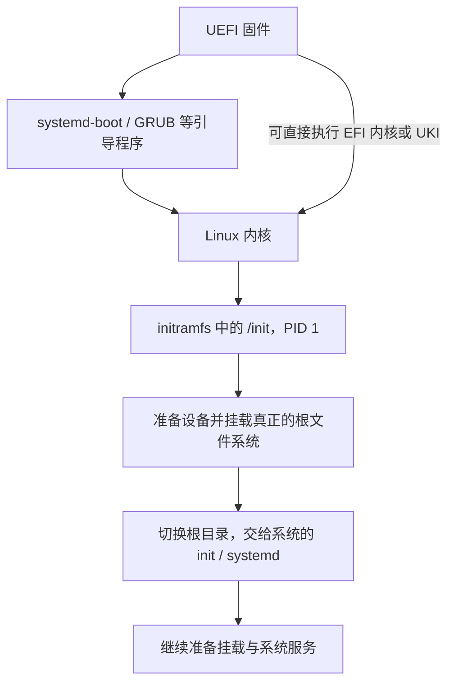

> AI 创作声明：本系列文章使用 gpt-5.6-sol 与 DeepSeek 4.1 Flash 辅助创作。

系统还没启动的时候，磁盘上的程序是谁读出来的？读出了内核，为什么又要准备一个 initramfs？等到屏幕上出现 systemd 的日志，是不是就说明根文件系统已经挂载好了？

这几个问题对应的是启动过程中不同的交接点。[全景篇](/posts/linux-desktop-architecture/)把它们串在了一起，这篇从按下电源讲到磁盘上的系统接手。认证、PAM 与密钥环放在[登录、身份与用户会话](/posts/linux-desktop-login-session/)中讨论。

## 固件先找到一个能执行的程序

> 固件负责完成早期硬件初始化，并选择下一阶段要执行的启动程序。采用 UEFI 的机器通常从 EFI
> System Partition 读取 EFI 程序，具体启动方式见
> [UEFI 规范](https://uefi.org/specifications)。

开机后，固件先做早期硬件初始化，再把控制权交出去。本文以 UEFI 机器为例：常见路径是固件启动 systemd-boot 或 GRUB，再由它们选择并加载 Linux 内核。这里没有 Linux 进程，也没有 systemd 服务，磁盘上安装了 systemd 并不代表它已经开始工作。[systemd 的 bootup 手册](https://github.com/systemd/systemd/blob/main/man/bootup.xml)从固件开始说明了这条路径。

引导程序也不是必须单独存在的一层。带有 EFI boot
stub 的 Linux 内核可以作为 EFI 可执行文件，由固件直接启动；stub 承担把执行环境交给内核的工作。也就是说，「没有 GRUB 菜单」本身并不能说明启动出了问题。参见[内核的 EFI boot stub 文档](https://docs.kernel.org/admin-guide/efi-stub.html)。

UEFI 启动里经常遇到 ESP（EFI System
Partition，EFI 系统分区）。以 systemd-boot 为例，它从 ESP，以及存在时的 XBOOTLDR 分区读取启动项和启动文件。Linux 运行后，ESP 可以挂在
`/boot`、`/efi` 或 `/boot/efi`
等位置；这些是运行时的挂载路径，不是固件已经有了一个 Linux 根目录。具体路径要跟机器的配置对应。[systemd-boot 手册](https://github.com/systemd/systemd/blob/main/man/systemd-boot.xml)列出了这些位置。

同样使用 systemd-boot，启动文件也可能采用不同的组织方式。Type 1 启动项是分区内
`/loader/entries/` 下的描述文件，通常指定内核、initrd 和启动参数；Type 2 则是在
`/EFI/Linux/`
下放 UKI。这里的路径都相对于存放启动文件的分区，不能直接当作当前系统的绝对路径。两种方式都由
[systemd-boot 的启动项说明](https://github.com/systemd/systemd/blob/main/man/systemd-boot.xml)定义。

UKI（Unified Kernel Image）把 EFI
stub、内核，以及可选的 initrd、命令行等资源放进一个 EFI 文件。stub 启动后取出这些资源，再进入内核。它改变了启动文件的打包方式，后面的内核初始化、准备根文件系统等工作仍然要做。[UKI 规范](https://uapi-group.org/specifications/specs/unified_kernel_image/)说明了文件内容与执行过程。

## 内核起来了，磁盘上的系统还未必能用

引导程序把内核和需要的启动数据装入内存，然后交出控制权。到这里，Linux 才开始执行。若使用 initramfs，内核会把这个 cpio 归档解包到内存中的 rootfs，找到
`/init`
并运行它。外部 initramfs 可以由引导程序提供，也可以把内容内置进内核；文件名里常见的
`initrd`
仍被用来称呼这种镜像，不能只看名字就把它当成早期的 ramdisk 块设备镜像。参见[内核的 initramfs 文档](https://docs.kernel.org/filesystems/ramfs-rootfs-initramfs.html)。

为什么不直接运行磁盘上的程序？因为访问那个文件系统可能还缺条件。存储驱动可能需要加载，根文件系统可能位于加密卷、LVM 或 RAID 上，需要先把这些设备准备好。initramfs 提供了一个包含程序、库和必要模块的早期工作环境，使这些准备工作能在最终的根目录可用之前完成。[内核文档对早期用户空间的解释](https://docs.kernel.org/filesystems/ramfs-rootfs-initramfs.html)也把复杂的存储准备列为采用这种设计的原因。

因此，initramfs 已经是用户空间了。它的 `/init` 作为 PID
1 运行，负责继续启动系统；systemd 也可以在这里充当 init。不能把「内核 → initramfs
→ 根目录 → PID 1」理解成 PID
1 只在最后才出现。到真正的根文件系统就绪后，早期 init 切换根目录，再把工作交给其中的 init 或系统管理器。交接边界是程序与根目录的变化，PID
1 的职责从早期启动延续下来。[内核文档](https://docs.kernel.org/filesystems/ramfs-rootfs-initramfs.html)与
[systemd 的 initrd 启动说明](https://github.com/systemd/systemd/blob/main/man/bootup.xml)分别描述了这两部分。

下图画的是采用 initramfs 的常见路径。箭头表示控制权或启动职责的交接，不代表所有硬件都已经在这一步探测完毕。



这也不是所有 Linux 系统都要走的固定流程。内核文档描述了没有可执行的 initramfs `/init`
时，由内核尝试直接挂载根文件系统并启动 init 的路径；它要求访问根文件系统所需的条件已经具备。[initramfs 文档](https://docs.kernel.org/filesystems/ramfs-rootfs-initramfs.html)中的这个分支，也解释了为什么精简系统可以没有单独的早期用户空间镜像。

## 根文件系统怎样变成可用的根目录

根文件系统的位置需要传给早期用户空间。以 systemd initrd 为例，`systemd-fstab-generator`
可以读取启动命令行里的 `root=`，也可以在 `root=fstab` 时从 initrd 内的 `/etc/fstab`
获取根文件系统配置。它还支持自动发现等方式，因此 `root=`
后面不一定是一个设备路径。这里的命令行虽然随内核一起传入，相关参数却由用户空间程序解释。参见
[systemd-fstab-generator 手册](https://github.com/systemd/systemd/blob/main/man/systemd-fstab-generator.xml)。

「知道根文件系统在哪」跟「能够挂载它」是两件事。指定目标之后，设备必须出现，所需的解密或存储组合必须完成，文件系统才能挂上去。在使用 systemd 的 initrd 中，根文件系统通常先挂在
`/sysroot`，对应 `sysroot.mount`；`initrd-root-fs.target`
表示这一段的进展，随后还可能需要准备单独的 `/usr`
或其他早期挂载，最后才切换根目录。这个顺序见
[bootup 的 initrd 流程](https://github.com/systemd/systemd/blob/main/man/bootup.xml)。

所以，看到 systemd 的输出，还要确认它来自 initrd 还是正式系统。看到根文件系统已经挂载，也不能推断后续的每个挂载和服务都正常。交接之后，系统管理器还会继续处理其余设备、文件系统与服务，具体的依赖关系留到[系统服务、设备与通信](/posts/linux-desktop-system-foundations/)展开。

发行版的区别主要体现在：谁生成启动镜像，配置从哪里来，镜像里用哪一种早期 init。

在 NixOS 中，`fileSystems` 描述要挂载的文件系统；安装时生成的 `hardware-configuration.nix`
通常已经根据当时的挂载情况填好这些配置。早期启动需要的模块则由 `boot.initrd`
下的配置参与决定。比如 `boot.initrd.kernelModules`
用于把指定模块及其依赖加入 initrd。需要对照的是声明最终生成的启动环境，而不只是安装后的系统里有没有那个模块。[NixOS 手册的 Manual Installation 与 Linux Kernel 章节](https://nixos.org/manual/nixos/stable/)说明了这两个入口。

还要留意版本。NixOS 26.05 手册中，脚本式 stage 1 已被标为默认关闭、弃用，启用与否受
`boot.initrd.systemd.enable` 控制。查老配置或旧教程时，不能把脚本式 stage
1 的调试参数直接套到 systemd
initrd 上。[NixOS 手册的 Boot Problems 章节](https://nixos.org/manual/nixos/stable/)把两种实现分开列出。

如果使用 Arch，并选择 mkinitcpio 生成 initramfs，则主要看 `/etc/mkinitcpio.conf`
及其 drop-in 配置：`MODULES` 控制额外加入并在启动时加载的模块，`HOOKS`
控制参与生成镜像的钩子，顺序会影响启动时的处理。它与 NixOS 的配置语法不同，但最终仍然要回答同一个问题：这个镜像能否把目标文件系统准备好？参见 Arch 官方的
[mkinitcpio(8)](https://man.archlinux.org/man/mkinitcpio.8) 与
[mkinitcpio.conf(5)](https://man.archlinux.org/man/mkinitcpio.conf.5)。

## 用稳定标识挂载文件系统

配置里怎样描述「我要挂载的那个文件系统」很有讲究。`/dev/sda1`
这类名称描述内核当前给出的设备节点；增加、移除或重新配置硬件后，名称可能变化。文件系统 UUID 则标识文件系统本身，不跟着设备枚举名称一起变化。`UUID`
与 `PARTUUID`
也要分开：后者标识分区，独立于里面的文件系统。[util-linux 的 mount 手册](https://github.com/util-linux/util-linux/blob/master/sys-utils/mount.8.adoc)解释了这些标识及设备名不稳定的问题。

例如，一份 NixOS 配置曾把 `/boot` 从易受设备枚举顺序影响的路径改成文件系统 UUID：

```nix
fileSystems."/boot" = {
  device = "/dev/disk/by-uuid/90FB-9F88";
  fsType = "vfat";
};
```

完整改动见[作者的配置记录](https://github.com/ryan4yin/nix-config/commit/0504d0503ba7d62882f47798ff77c2449d2da4ff)。这里值得借鉴的是使用稳定标识，而不是照抄示例中的 UUID；每台机器都要以自己的文件系统信息为准。

这个例子尤其容易读错：改的是 `/boot`，不是根目录
`/`。固件或引导程序读取启动文件，与 Linux 启动后把 ESP 挂载到
`/boot`，处于不同阶段。NixOS 还要求 ESP 的实际挂载点与引导配置相符，参见[手册安装部分的 ESP 挂载说明](https://nixos.org/manual/nixos/stable/)。因而
`/boot`
的配置错误可以成为启动调查的线索，但不能据此直接推断成「initramfs 找不到根分区」。两者涉及的挂载目标和启动阶段都不同。

从机制上说，稳定标识能避免因设备枚举名称变化而选错目标，但它仍要跟实际文件系统对应。尤其是复制磁盘之后，UUID 也可能重复；使用 UUID 并不自动保证唯一，更不能解决驱动缺失、解密失败或文件系统损坏。[mount 手册](https://github.com/util-linux/util-linux/blob/master/sys-utils/mount.8.adoc)明确提醒过 UUID 重复的情况。

回到一台正在排查的机器，可以先把问题拆开：是设备没出现，还是配置指向了错误的设备？设备正确时，文件系统有没有成功挂载？挂载成功之后，等待的是不是另一个挂载或服务？这些问题对应的证据不同，不宜看到「启动失败」就直接做文件系统修复。

## 从正在运行的系统反查启动路径

下面的命令都只读取状态。它们观察的是这一次已经成功运行起来的系统，适合核对启动输入和交接结果；如果机器根本无法启动，则要在引导界面、救援系统或另一台机器上检查相同的文件和分区。

### 固件把控制权交给了谁

先让 `bootctl` 汇总固件和当前引导程序信息：

```console
$ bootctl status
System:
      Firmware: UEFI 2.90
   Secure Boot: enabled (user)
  TPM2 Support: yes

Current Boot Loader:
        Product: systemd-boot 261.1
```

这里只摘取不含分区标识和启动项文件名的字段。它们说明笔者的机器以 UEFI 启动、Secure
Boot 已启用，当前引导程序报告自己是 systemd-boot。`bootctl status`
还可能打印 ESP、PARTUUID、机器标识和完整启动项，分享输出前应先检查。命令能证明本次启动留下的状态，不能单独证明 ESP 中的每一个文件都完整。

接着可以列出引导程序发现的启动项：

```console
bootctl list --no-pager
```

重点看默认项、选中项、启动项类型以及它引用的内核或 UKI。读取 ESP 中的文件通常需要相应权限；不要为了“修复”而直接删除旧启动项。若列表中的默认项与本次实际启动项不同，先分清是在查看下次启动的默认选择，还是本次启动留下的记录。

### 内核和早期用户空间收到了什么

`/proc/cmdline` 给出本次启动实际传给内核及早期用户空间的命令行：

```console
$ cat /proc/cmdline
init=/nix/store/.../init nvidia-drm.fbdev=1 root=<已隐藏> loglevel=4 lsm=landlock,yama,apparmor,bpf
```

这里隐藏了根文件系统标识，并缩短了 Nix store 路径。检查时可以先找
`root=`、`resume=`、`rd.luks.*`、`init=`
等参数，再到相应组件的手册确认是谁解释它们。不要把所有参数都称为“内核参数”：例如 `root=`
也可能由 initrd 中的生成器读取。

然后比较块设备、文件系统与实际挂载。`lsblk` 展示块设备之间的关系，`findmnt`
展示当前挂载命名空间中的结果：

```console
$ lsblk -o NAME,TYPE,FSTYPE
NAME           TYPE  FSTYPE
nvme1n1        disk
├─nvme1n1p1    part  vfat
└─nvme1n1p2    part  crypto_LUKS
  └─nixos-luks crypt btrfs

$ findmnt -n -o TARGET,SOURCE,FSTYPE /
/ tmpfs tmpfs
```

这台机器的输出能看到“磁盘分区 → LUKS 映射 →
Btrfs”的存储层次；根目录当前显示为 tmpfs，则是笔者所用 NixOS 配置的结果，不是通用默认值。需要核对稳定标识时，可运行：

```console
lsblk -o NAME,FSTYPE,UUID,PARTUUID,MOUNTPOINTS
blkid
```

`UUID` 标识文件系统，`PARTUUID`
标识分区。两条命令的完整输出包含本机标识，不适合原样贴到公开求助帖。它们能帮助核对配置指向了谁，但不能证明解密口令、驱动或文件系统内容没有问题。

### 时间花在了哪一段

先看各阶段总计：

```console
$ systemd-analyze
Startup finished in 9.474s (firmware) + 10.727s (loader) + 751ms (kernel) + 3.000s (initrd) + 8.751s (userspace) = 32.705s
graphical.target reached after 3.815s in userspace.
```

不带子命令时，`systemd-analyze` 查询的是
`time`。输出把固件、引导程序、内核、initrd 与正式用户空间分开计时，但不表示所有服务都已完成初始化，更不表示桌面已经可用。

如果用户空间阶段较慢，再沿目标的时间关键链往回看：

```console
$ systemd-analyze critical-chain graphical.target

graphical.target @3.815s
└─greetd.service @3.815s
  └─systemd-user-sessions.service @3.796s +15ms
    └─basic.target @2.966s
      └─dbus-broker.service @2.890s +62ms
        └─dbus.socket @2.884s
```

`@` 后面是单元进入 active 或开始的时间，`+` 后面是启动耗时。这里说明抵达
`graphical.target`
的这条链经过 greetd、用户登录开关和 D-Bus；它不是“最慢服务排行榜”，也不会显示没有落在这条关键链上的并行工作。若要调查某个单元，应继续用
`systemctl show`、`systemctl status`
和该单元的 journal 验证，而不是仅凭一张耗时表禁用服务。

这些观察把引导状态、启动输入、存储层次和 systemd 的接手结果连了起来。接下来读[系统服务、设备与通信](/posts/linux-desktop-system-foundations/)，看挂载、设备与服务之间的关系怎样落实成单元和事件。
