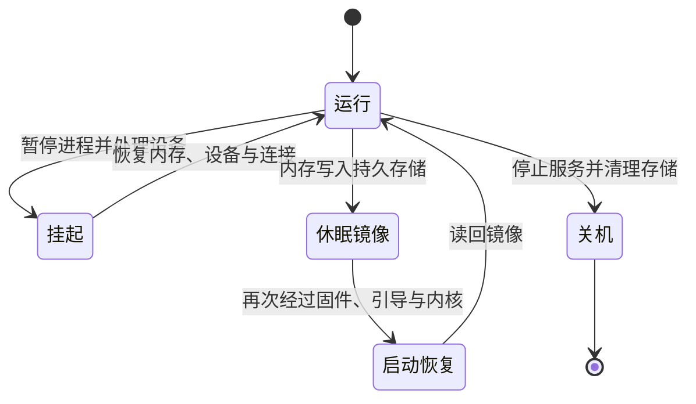

> AI 创作声明：本系列文章使用 gpt-5.6-sol 与 DeepSeek 4.1
> Flash 辅助创作。写作时先查阅上游官方文档，再在本机运行可以安全执行的命令，并结合[作者的 Nix 配置仓库](https://github.com/ryan4yin/nix-config)中的实际案例和独立技术审查交叉核对；无法在当前环境验证的部分会明确注明。

前几篇依次讲了开机、登录和应用运行。离开桌面时，系统还要决定怎样保存或结束这些工作：挂起让进程暂停，关机让它们退出；休眠则把可恢复的内存状态写入持久存储。三种操作会用到部分相同的组件，最终保留的状态却不同。

我在 NixOS 配置历史里记录过一次 S3 恢复后的网络问题。桌面恢复后，不只内存里的程序要继续运行，设备和网络连接也要重新进入可用状态。这个案例的网络细节放在[网络篇](/posts/linux-desktop-network/)，这里解释它与电源状态转换的关系。

先把几种操作分开。挂起后仍从内存继续运行；休眠需要在下一次启动时读回磁盘上的镜像；关机则结束当前系统，之后重新启动一个新实例。



## 谁决定合盖之后做什么

在采用 systemd 的桌面上，logind 提供 `Suspend`、`Hibernate`、`PowerOff`
等 D-Bus 方法。桌面程序可以经由这个接口请求电源操作，logind 会结合授权与 inhibitor
lock 处理请求。inhibitor
lock 是应用向系统声明「这项操作需要阻止或暂缓」的机制。接口本身在[登录会话篇](/posts/linux-desktop-login-session/)已有背景，电源方法见
[login1 手册](https://man.archlinux.org/man/org.freedesktop.login1.5.en)。

电源键与合盖事件又多了一层策略。logind 的 `HandlePowerKey`、`HandleLidSwitch`
等选项可以规定动作，但桌面环境也能取得相应的底层 inhibitor
lock，接管这些事件。接管后，相关 `Handle*`
选项不再决定该事件的动作。因此，修改合盖设置前，需要知道当前是 logind 还是桌面电源管理组件在处理它。见
[logind.conf](https://man.archlinux.org/man/logind.conf.5.en)。

准备进入睡眠时，logind 会发出
`PrepareForSleep(true)`。需要先锁屏或保存数据的应用，应预先持有 delay
inhibitor，在收到通知后完成工作并释放锁；延迟受超时限制，不能无限等待。仅订阅通知而不持有延迟锁，存在准备工作尚未完成就进入睡眠的竞态。恢复后可收到
`PrepareForSleep(false)`，但这个通知也可能对应操作失败，不能单凭它判断某次挂起成功。见
[systemd 的 inhibitor 协议](https://systemd.io/INHIBITOR_LOCKS/)。

这也解释了锁屏与挂起的分工：锁屏程序负责准备用户界面的访问限制，电源管理流程负责暂停系统。内核不会替桌面程序保存编辑器里尚未写入文件的内容。

## 挂起时，内核保留了什么

`suspend.target` 会拉入 `systemd-suspend.service`，后者根据睡眠配置，通过 `/sys/power/`
接口请求内核转换状态。当前 systemd 的睡眠服务默认在进入和离开睡眠期间冻结
`user.slice`；这段时间用户进程不能运行。睡眠钩子若等待用户服务的响应，就可能等不到。上游因此建议应用使用 inhibitor 协议，而不是依赖低层钩子与用户会话通信。见
[systemd-suspend.service](https://man.archlinux.org/man/systemd-suspend.service.8.en)。

内核提供的挂起方式不只有一种：

| 内核挂起方式 | 状态怎样保留                                         | 平台边界                                                 |
| ------------ | ---------------------------------------------------- | -------------------------------------------------------- |
| `s2idle`     | 冻结用户空间，让设备进入低功耗状态，CPU 进入空闲状态 | 不要求平台提供 S3；它不是 ACPI S2                        |
| `shallow`    | 除冻结用户空间外，还暂停更多底层系统功能             | 对应 standby；在 ACPI 平台上对应 S1                      |
| `deep`       | 内存保持内容，设备与 CPU 的恢复信息留在内存中        | 对应 suspend-to-RAM；在 ACPI 平台上对应 S3，需要平台支持 |

这些模式都依赖内存内容继续保留，完全失去供电会丢失尚未持久化的状态。可用模式取决于内核配置和平台支持，不能由「安装了 Linux」推导出一定有
`deep`。内核的
[System Sleep States](https://docs.kernel.org/admin-guide/pm/sleep-states.html)
定义了上述模式；systemd 的[睡眠模式说明](https://man.archlinux.org/man/systemd-sleep.conf.5.en)说明了断电时的区别。

设备也有自己的暂停过程。驱动需要停止 I/O，保存恢复所需的状态，并按硬件能力降低功耗；有唤醒能力且允许唤醒的设备，还需要准备相应信号。恢复时，驱动重新建立设备的工作状态。有些设备经历了复位，有些外接设备已经被移除，恢复回调必须处理这些情况。见内核的[设备电源管理文档](https://docs.kernel.org/driver-api/pm/devices.html)。

因此，不宜把挂起概括成「除了内存，所有东西都断电」。模式、总线和唤醒需求不同，设备实际状态也不同。同样，屏幕重新亮起只能说明显示已经恢复，还需要分别确认输入、声音、存储和网络能否继续工作。

## 休眠把恢复点放到磁盘上

休眠会创建内存快照，将镜像写入持久存储，然后进入目标低功耗状态或关机。内存无需继续供电。恢复时，固件和引导程序先启动一个新的内核实例；这个恢复内核读取镜像，再把执行交回镜像中的原内核，最终让原来的用户空间继续运行。它仍然经过启动路径的一部分，不能描述成完全跳过启动。见内核
[Hibernation](https://docs.kernel.org/admin-guide/pm/sleep-states.html#hibernation)。

Linux 的 swsusp 可以使用 swap 保存镜像，但配置好日常交换空间，还没有回答「下次启动怎样找到它」。恢复过程需要在挂载文件系统之前找到并读取镜像；休眠后若由另一个系统修改了同一文件系统，再恢复旧内存状态，可能破坏数据。这个约束把休眠与[启动篇](/posts/linux-desktop-boot/)里的 initramfs、存储驱动和根文件系统挂载顺序连了起来。见
[Swap suspend](https://docs.kernel.org/power/swsusp.html)。

交换分区与交换文件的定位方式也不同。交换文件需要知道承载它的块设备，以及文件头在设备上的页偏移；`resume_offset`
不是文件名，也不是文件系统 UUID。重新创建交换文件可能改变这个位置。见内核的[交换文件休眠说明](https://docs.kernel.org/power/swsusp-and-swap-files.html)。镜像需要足够的可用存储空间；所需大小与当时状态有关，不能只凭一个固定的「RAM 倍数」保证休眠可用。

systemd 还提供两种组合模式：`hybrid-sleep`
先保存镜像再挂起，失去内存供电后仍可从镜像恢复；`suspend-then-hibernate`
先挂起，再按电量或时间策略唤醒并转入休眠。二者的保存时机不同，都需要相应的挂起与休眠条件成立，具体策略见
[systemd-sleep.conf](https://man.archlinux.org/man/systemd-sleep.conf.5.en)。

### NixOS 与 Arch 的配置放在哪里

内核接口相同，发行版负责把设置放进正确的启动和服务配置中：

| 配置职责           | NixOS 26.05                                                      | Arch Linux / 上游 systemd 接口                                                                                |
| ------------------ | ---------------------------------------------------------------- | ------------------------------------------------------------------------------------------------------------- |
| 合盖、电源键策略   | `services.logind.settings.Login`                                 | `/etc/systemd/logind.conf.d/` 中的 `[Login]` 设置                                                             |
| systemd 睡眠策略   | `systemd.sleep.settings.Sleep`                                   | `/etc/systemd/sleep.conf.d/` 中的 `[Sleep]` 设置                                                              |
| 休眠存储与恢复入口 | `swapDevices`、`boot.resumeDevice`，交换文件还涉及偏移与启动参数 | 结合实际 initramfs 配置恢复入口；systemd 的恢复生成器可读取 `resume=`、`resume_offset=` 或适用的 EFI 位置记录 |

NixOS 的前两项分别生成 logind 与 sleep 配置，见
[logind 模块](https://github.com/NixOS/nixpkgs/blob/nixos-26.05/nixos/modules/system/boot/systemd/logind.nix)和
[systemd 模块](https://github.com/NixOS/nixpkgs/blob/nixos-26.05/nixos/modules/system/boot/systemd.nix)。休眠存储的入口见
[NixOS 电源管理文档](https://wiki.nixos.org/wiki/Power_Management#Hibernation)。涉及加密或逻辑卷时，还要确认恢复阶段能访问实际承载镜像的设备；复制另一个人的设备路径不能完成这一步。

Arch 这边需要区分 mkinitcpio 使用的 initramfs 方案：传统流程有独立的
[resume hook](https://github.com/archlinux/mkinitcpio/blob/master/install/resume)，[systemd hook](https://github.com/archlinux/mkinitcpio/blob/master/install/systemd)
则打包 systemd 的休眠恢复组件。上游的
[hibernate-resume-generator](https://man.archlinux.org/man/systemd-hibernate-resume-generator.8.en)
解释了恢复设备、偏移与 EFI 记录的识别规则。写作时 Arch
Wiki 的相关页面无法读取，这里的对照依据 Arch 项目源码与其发布的上游手册，没有把 Wiki 摘要当作已核验的配置步骤。

是否能恢复，取决于休眠镜像位置、initramfs 的恢复能力、存储解锁和设备驱动共同满足条件，不能由某个选项已经写入配置推断。

## 恢复内存之后，网络仍会变化

设备恢复后，用户空间还要处理随之而来的设备和链路事件；保存在内存里的进程，可能面对与挂起前不同的网络条件。

我的提交 `77e31bd4`
中，配置注释记录了 S3 恢复时 carrier 变化、networkd 重配置，以及外部 VPN/TUN 策略规则被清理的解释。差异增加了
`ManageForeignRoutingPolicyRules = false` 和
`IgnoreCarrierLoss = "10s"`，分别调整外部规则的管理边界和短暂断链的处理时机。详细语义与取舍见[网络篇的恢复案例](/posts/linux-desktop-network/#一次恢复事件怎样影响到应用)。

这份提交能证明当时记录了上述解释，并实施了两项配置改动；它没有附上完整的恢复前后路由快照或独立的成功验证。十秒是配置选择，不是测得的恢复耗时。此次修订也没有实际执行挂起或复现该问题。

读这个案例时，可以沿同一次事件依次问：设备是否恢复，carrier 是否变化，网络服务是否重配置，地址与策略规则是否仍符合预期，应用最终选择了哪个出口。这样能区分内核恢复、网络重配置与应用行为，不必把所有「唤醒后不好用」都归为同一个电源管理故障。

## 关机时怎样结束进程并卸载文件系统

关机不会创建供下一次启动恢复的内存镜像。经 logind 请求的关机可以通过 `PrepareForShutdown`
与 inhibitor 协议给应用准备机会，但保存动作仍由应用完成，不能保证所有未保存的文档都会自动落盘。

接下来，systemd 按单元关系安排停止。对于有 `Before` / `After`
顺序约束且都要停止的两个单元，停止顺序与启动顺序相反；没有顺序关系的单元可以并行停止。因此，全系统并不存在一份固定的「图形、网络、存储」串行清单。规则见
[systemd.unit](https://man.archlinux.org/man/systemd.unit.5.en)，依赖与顺序的区别可回看[系统基础篇](/posts/linux-desktop-system-foundations/)。

服务的停止命令与退出等待也可能失败或超时。`TimeoutStopSec`
控制停止等待，最终怎样处理还受终止信号、失败策略等配置影响。缩短超时会缩短服务清理的机会，不能用它证明原来的阻塞原因已经解决。见
[systemd.service](https://man.archlinux.org/man/systemd.service.5.en)。

进入最后的关机阶段后，PID 1 由 `systemd-shutdown`
接替。它尝试终止剩余进程、卸载剩余文件系统或至少将其重新挂载为只读，停用 swap，并分离剩余存储设备，然后执行关机动作。这些是需要完成或尝试的清理，不是无条件成功的保证。见
[systemd-poweroff.service](https://man.archlinux.org/man/systemd-poweroff.service.8.en)。

由此判断关机卡住的位置，比套一份耗时表更有用：是某个服务仍在停止，还是已经进入最后的文件系统与存储清理？下一次启动会[重新建立系统状态](/posts/linux-desktop-boot/)，判断方法与挂起后继续运行原进程并不相同。

## 只读查看支持的状态和历史事件

先在自己的机器上读取内核公开的状态。文件不存在或无读取权限时，停在这一步即可：

```console
cat /sys/power/state
cat /sys/power/mem_sleep
```

`state` 中的 `freeze` 表示 suspend-to-idle，`disk` 表示内核支持的休眠入口；`mem`
具体使用哪种挂起方式，要结合 `mem_sleep` 看。后者列出支持的模式，方括号标记当前与 `mem`
关联的选择。这些字段的定义见[内核 sysfs 接口](https://docs.kernel.org/admin-guide/pm/sleep-states.html#basic-sysfs-interfaces-for-system-suspend-and-hibernation)。读取不会切换状态；向这些文件写入则可能改变选择或触发睡眠，不是本节的练习。

此次修订实际读取到 `freeze mem disk` 与
`s2idle [deep]`。它们证明当前内核提供这些入口，且当时选择了
`deep`；不能据此证明 swap、恢复路径、唤醒设备已经配置正确，也不能代替一次实际恢复的验证。

若有读取系统 journal 的权限，可只查看本次启动里挂起服务的记录：

```console
journalctl -b -u systemd-suspend --no-pager
```

`-b` 限定启动，`-u` 筛选该单元及 systemd 对它的相关记录，`--no-pager`
关闭分页。输出仍可能含主机名、时间与本地钩子的消息，分享前需删去私人信息；它也不会包含所有驱动或网络服务的日志。选项见
[journalctl](https://man.archlinux.org/man/journalctl.1.en)。

本次查询退出正常，在不输出原始日志的检查中，识别到了已有的进入睡眠和从睡眠返回消息。这里没有新发起任何电源操作；既有服务消息也不足以验证显示、网卡或应用连接在那些事件后都恢复正常。

结合这些信息回看[系列全景](/posts/linux-desktop-architecture/)，就能按时间梳理一台桌面的运行过程：启动时建立系统状态，应用随后使用设备与服务；挂起会暂停执行，恢复后要重新确认设备和网络状态，关机则结束进程并清理资源。
