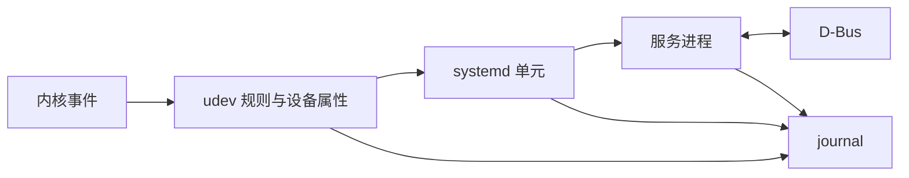

> AI 创作声明：本系列文章使用 gpt-5.6-sol 与 DeepSeek 4.1 Flash 辅助创作。

这一篇会反复遇到四组对象。它们不在同一层，却经常出现在同一次排查中：systemd 安排服务，journal 保存日志，udev 处理设备事件，D-Bus 让进程互相调用。



[上一篇](/posts/linux-desktop-boot/)讲到，早期用户空间准备好根文件系统后，会把启动工作交给正式系统。接下来，挂载和后台服务怎样组织起来？设备插上以后，程序又怎样知道它出现了？

以本系列使用的 systemd 系统为例，PID
1 的 systemd 是系统管理器，负责启动和管理系统服务；另有用户实例管理用户自己的服务。systemd-journald、systemd-udevd 则是独立运行的服务，并不是 PID
1 里几个可随意替换的函数。先把管理器和被管理的程序分开，后面读日志或配置时就容易多了。参见
[systemd 概览](https://github.com/systemd/systemd/blob/main/man/systemd.xml)、[journald](https://github.com/systemd/systemd/blob/main/man/systemd-journald.service.xml)
与 [udev 手册](https://github.com/systemd/systemd/blob/main/man/udev.xml)。

## systemd 等待的到底是什么

> systemd 用 unit 表示服务、挂载点、设备和启动目标等对象。依赖关系决定事务中需要包含什么，顺序关系决定任务先后；两者不是同一回事。完整定义见
> [systemd.unit](https://github.com/systemd/systemd/blob/main/man/systemd.unit.xml)。

systemd 把要管理的对象称为 unit（单元）。`.service` 描述服务进程，`.mount`
对应挂载点，`.device` 表示设备，`.socket` 可以参与按需启动服务；`.target`
用来组织一组单元或提供同步点。因而「启动系统」包含的工作远比启动一串后台进程多。单元也不一定都有一份手写文件，有些来自生成器或运行时状态。[systemd 手册的 Units 部分](https://github.com/systemd/systemd/blob/main/man/systemd.xml)解释了这些对象。

读依赖配置时，我建议先分开两个问题：另一个单元是否也要启动，以及两者谁先谁后。假设有两个示意单元 A 和 B：

| A 中的配置   | 启动 A 时的含义                                           |
| ------------ | --------------------------------------------------------- |
| `Wants=B`    | 一起拉起 B，但 B 启动失败本身不阻止 A 启动                |
| `Requires=B` | 一起拉起 B；若还配置了 `After=B`，B 启动失败会阻止 A 启动 |
| `After=B`    | 两者都有启动任务时，A 等 B 的启动任务结束；它本身不拉起 B |
| `Before=B`   | 两者都有启动任务时，A 的启动任务排在 B 前面               |

这里的 A、B 只是关系示意，不是可直接复制的单元名。需求依赖和顺序关系相互独立；只有
`Wants=` 或 `Requires=` 时，两者可以并行启动。`Requires=`
也不能理解成持续健康检查：例如被依赖的进程自行正常退出，不保证依赖它的单元随之停止。具体语义见
[systemd.unit 的依赖说明](https://github.com/systemd/systemd/blob/main/man/systemd.unit.xml)。

那「B 的启动任务结束」是不是说明 B 已经能用了？还要看 B 怎样向 systemd 表达就绪。`Type=simple`
在创建服务进程后就认为启动完成，甚至不等待程序成功执行；`Type=exec`
会等到执行成功，但仍不等待程序内部初始化。支持通知协议的 `Type=notify`
服务则会在初始化完成后发送 `READY=1`。随便把配置改成 `notify`
没用，程序本身也得支持它。[systemd.service](https://github.com/systemd/systemd/blob/main/man/systemd.service.xml)逐项定义了这些启动条件。

同理，target 到达也不能当作整个桌面的健康证明。target 本身没有应用逻辑，它通过依赖组织其他单元，默认还会补充相应的排序关系。能否打开窗口、完成一次请求，仍取决于参与其中的服务与应用。[systemd.target 手册](https://github.com/systemd/systemd/blob/main/man/systemd.target.xml)说明了这种分组和同步用途。

还有一个常见混淆：启用与运行是两个状态。单元的 `[Install]` 配置参与建立启用时的链接，比如
`WantedBy=` 使目标单元获得指向它的 `Wants` 关系；systemd 平时并不直接用 `[Install]`
来决定运行状态。因此，不能看到 enabled 就推断进程正在运行。参见
[systemd.unit 的安装段说明](https://github.com/systemd/systemd/blob/main/man/systemd.unit.xml)。

NixOS 把这层配置放进声明里：`systemd.services` 下的 `after`、`requires`、`wantedBy` 和
`serviceConfig`
等字段参与生成服务定义。排查时既要读声明，也要确认运行中的状态，不能把修改了 Nix 文件当作已经应用。[NixOS 手册的 Defining custom services](https://nixos.org/manual/nixos/stable/)给出了这些字段。Arch 使用同一个上游单元格式，包提供的单元与管理员的 drop-in 则按加载路径和优先级合并，参见
[Arch 的 systemd.unit(5)](https://man.archlinux.org/man/systemd.unit.5.en)。

## journal 能告诉我们什么

服务启动失败时，需要把「管理器认为发生了什么」和「程序自己输出了什么」放在一起看。systemd-journald 收集内核消息、syslog 消息、原生 journal 消息，以及服务的标准输出和标准错误，保存为带字段的日志。服务输出默认连接到 journal，但配置可以改变这个去向，所以不能假定每个程序的全部输出都在这里。[journald 手册](https://github.com/systemd/systemd/blob/main/man/systemd-journald.service.xml)列出了入口和默认连接方式。

`journalctl`
是读取 journal 的客户端。按启动批次与单元筛选，可以把一次启动失败缩小到相关服务；其中 `-u`
不只匹配服务自身输出，也包含 systemd 对该单元的消息等额外记录。它不等价于只匹配一个
`_SYSTEMD_UNIT`
字段。[journalctl 手册](https://github.com/systemd/systemd/blob/main/man/journalctl.xml)说明了这些过滤条件。

日志能回答的是已有记录中的事件。没有搜到一条错误，并不能说明操作成功：日志可能未被收集，也可能已经不再保留。尤其要分清易失与持久存储，前者在
`/run/log/journal/`，重启后会丢失；后者在 `/var/log/journal/`。`Storage=`
控制存储方式，容量与保留期限还受其他设置影响。参见
[journald.conf](https://github.com/systemd/systemd/blob/main/man/journald.conf.xml)。排查一次重启之前的问题，要先确认那次启动的日志还在。

## 设备节点出现以后，udev 继续做什么

在启用了 devtmpfs 的系统中，内核可以在这个文件系统里维护设备节点，udev 再根据规则调整权限等属性。设备节点提供用户空间访问设备的入口，不能把它当成普通的数据文件。devtmpfs 与 udev 的分工见[内核 DEVTMPFS 配置说明](https://github.com/torvalds/linux/blob/master/drivers/base/Kconfig)。

设备增加、移除或状态改变时，内核发出 uevent，systemd-udevd 接收后匹配规则。规则可以补充属性、设置设备节点权限、增加有意义的符号链接；处理后的信息存入 udev 数据库，并通知订阅者。[udev 手册](https://github.com/systemd/systemd/blob/main/man/udev.xml)描述了这条路径。

这也是为什么「内核看见了设备」与「应用能使用设备」之间还有距离。节点可能已经存在，但权限或规则还不符合应用的要求；有稳定别名，也不等于驱动和应用协议都正常。上一章的[挂载标识案例](/posts/linux-desktop-boot/)关注设备路径怎么选择，这里关注设备事件到了用户空间后怎样继续处理。

systemd 也可以把带有 `systemd` 标签的 udev 设备表示为 `.device`
单元，让其他单元依赖设备状态。它并不会为所有设备无条件创建同样的服务。[systemd.device 手册](https://github.com/systemd/systemd/blob/main/man/systemd.device.xml)解释了标签和设备单元的关系。具体到谁能使用当前座席的设备，还涉及登录会话，留到[登录、身份与用户会话](/posts/linux-desktop-login-session/)再说。

### 同一条规则可能来自不同地方

以 Android 设备为例，当前 systemd 上游的
[70-uaccess.rules.in](https://github.com/systemd/systemd/blob/main/rules.d/70-uaccess.rules.in)确实有针对 Android
ADB、Fastboot 接口的匹配规则。有些发行版还会通过单独的软件包提供额外规则，本地管理员也可以在
`/etc/udev/rules.d/` 中覆盖或补充规则。

NixOS 的 `services.udev.packages`
用来收集软件包提供的规则，Arch 软件包也可以把规则安装到系统 udev 目录。配置入口不同，真正要检查的都是最终加载了哪些规则、哪一条匹配了当前设备。[NixOS 26.05 的 udev 模块](https://github.com/NixOS/nixpkgs/blob/nixos-26.05/nixos/modules/services/hardware/udev.nix)定义了前一种入口。

因此，遇到设备访问问题时，除了确认设备有没有出现，还要继续追规则从哪里来、有没有被覆盖、是否匹配到了当前设备。不能因为某个额外规则包没有安装，就认定系统里缺少对应规则。

## D-Bus 把请求交给谁

> D-Bus 是进程间通信协议。服务通过总线名称、对象路径和接口公开功能，调用方发送方法调用并接收回复或信号。完整模型见
> [D-Bus specification](https://dbus.freedesktop.org/doc/dbus-specification.html)。

进程需要协作时，可以通过 D-Bus 发送方法调用、接收回复或订阅信号。总线根据名称把消息送到对应连接，具体工作由接收请求的服务完成。规范区分系统总线与会话总线，前者供系统范围的服务通信，后者供用户环境中的应用协作。两者是不同的总线，找到一个服务之前先要选对它所在的总线。[D-Bus 规范](https://dbus.freedesktop.org/doc/dbus-specification.html)的 Message
Bus 与 Well-known Message Bus Instances 部分定义了这些概念。

一次方法调用还要指定对象路径、接口和方法。下面借总线自身提供的标准接口说明这些名字各管什么：

| 部分     | 例子                                  | 用途                     |
| -------- | ------------------------------------- | ------------------------ |
| 总线名称 | `org.freedesktop.DBus`                | 选择消息接收方           |
| 对象路径 | `/org/freedesktop/DBus`               | 选择接收方提供的对象     |
| 接口     | `org.freedesktop.DBus.Introspectable` | 选择对象的一组接口约定   |
| 方法     | `Introspect`                          | 请求对象返回接口描述 XML |

对象路径不是磁盘目录。`Introspect`
返回对象支持的方法、信号、属性等描述；属性读取则通常通过
`org.freedesktop.DBus.Properties.Get` 完成，需要给出目标接口和属性名。这些名称和参数由
[D-Bus 标准接口规范](https://dbus.freedesktop.org/doc/dbus-specification.html#standard-interfaces)定义，不宜凭打印结果猜一个方法名。

总线还支持按需激活：名字尚无拥有者时，符合条件的请求可以启动提供该名字的程序。因此，观察命令也要留意是否会触发激活。[D-Bus 的服务激活规范](https://dbus.freedesktop.org/doc/dbus-specification.html#message-bus-starting-services)解释了这个过程。后续应用篇会用到这些概念，但
[portal 与沙盒的具体调用](/posts/linux-desktop-app-integration/)放在那里展开。

## 动手观察这四组对象

下面选用 journald、`/dev/null`
和系统总线自身做练习，避免碰真实业务服务和带序列号的硬件。换成你要排查的对象时，仍然沿用同一组问题：配置从哪里来，运行状态是什么，依赖谁，留下了哪些日志，又通过什么接口与其他进程通信？

### 从单元文件追到运行状态

先看 systemd 最终加载的单元内容。`systemctl cat`
会按加载顺序显示主文件和 drop-in，比只打开某一个目录里的文件更可靠：

```console
$ systemctl cat systemd-journald.service --no-pager
# /etc/systemd/system/systemd-journald.service -> /nix/store/.../systemd-journald.service
[Unit]
Requires=systemd-journald.socket
After=systemd-journald.socket systemd-journald-dev-log.socket

[Service]
Type=notify-reload
```

这是笔者 NixOS PC 上删减后的输出。NixOS 生成的单元通常指向 Nix
store；Arch 上包提供的主文件通常位于 `/usr/lib/systemd/system/`，管理员覆盖则放在
`/etc/systemd/system/`。路径不同，`systemctl cat` 展示“最终合并结果”的用途相同。

再从运行中的管理器读取少量属性：

```console
$ systemctl show systemd-journald.service \
    -p Id -p LoadState -p ActiveState -p SubState -p Type
Id=systemd-journald.service
LoadState=loaded
ActiveState=active
SubState=running
Type=notify-reload
```

`LoadState=loaded` 说明单元定义已加载，`ActiveState` 和 `SubState` 描述当前状态，`Type`
来自服务配置。它们不能证明 journal 中每条记录都已持久保存。需要继续看依赖时，再展开单元树：

```console
$ systemctl list-dependencies systemd-journald.service --plain --no-pager
systemd-journald.service
  -.mount
  system.slice
  systemd-journald-audit.socket
  systemd-journald-dev-log.socket
  systemd-journald.socket
```

这能解释 journald 从哪些 socket 接收数据，也说明依赖树里不只有 `.service`。不过
`list-dependencies` 展示的是依赖关系，不是实际启动时间线；时间问题要另看
`systemd-analyze critical-chain` 和日志时间戳。

### 写一条日志，再按字段把它找回来

与其拿一段未知来源的系统日志猜字段，不如先写一条没有敏感信息的测试消息：

```console
$ logger -t linux-desktop-lab -- \
    "boundary-check component=journal result=ok"

$ journalctl -t linux-desktop-lab -n 1 \
    -o json-pretty --no-pager
{
    "SYSLOG_IDENTIFIER" : "linux-desktop-lab",
    "MESSAGE" : "boundary-check component=journal result=ok",
    "PRIORITY" : "5",
    "_TRANSPORT" : "syslog"
}
```

`-t`
按 syslog 标识筛选，JSON 输出则让字段边界清楚可见。实际记录还包含时间、UID、PID、主机和启动批次等字段，这里没有贴出。下一步可以按问题增加过滤条件，例如：

```console
journalctl -b -u systemd-journald.service --no-pager
journalctl _BOOT_ID=<某次启动的 ID> PRIORITY=0..3 --no-pager
```

第一条把范围限制在本次启动和一个单元，第二条把范围限制在某次启动的 error 及以上优先级。过滤能缩小证据范围，但“没有匹配记录”仍不能证明故障没有发生。

### 从设备属性反推规则怎样匹配

先读取 udev 数据库中一个明确的属性：

```console
$ udevadm info --query=property \
    --property=SUBSYSTEM --name=/dev/null
SUBSYSTEM=mem
```

如果要写或核对规则，再查看设备及其父设备的可匹配属性：

```console
$ udevadm info --attribute-walk --name=/dev/null
looking at device '/devices/virtual/mem/null':
  KERNEL=="null"
  SUBSYSTEM=="mem"
  DRIVER==""
```

一条规则可以匹配设备自身的多个属性，也可以匹配同一个父设备的属性；不能随意把不同父层级的条件拼在一起。换成 USB、摄像头或输入设备时，输出可能含厂商、型号和序列号，公开前要删去不必要的标识。

`udevadm test-builtin` 可以在测试模式中运行某个内置处理器。例如下面的命令验证 `uaccess`
对该 sysfs 路径的计算流程，不会真的改写 `/dev/null`：

```console
$ udevadm test-builtin uaccess /sys/class/mem/null
null: Running in test mode, skipping execution of 'uaccess' builtin command.
```

测试结果只针对给定设备和当前加载的规则。调查真实设备时，还要用
`udevadm monitor --kernel --udev --property`
观察一次插拔事件，并在分享输出前检查设备标识；不要仅凭静态测试断言事件链正常。

### 从总线名称走到方法签名

先看一个服务在 D-Bus 上导出了哪些对象。系统总线自身只有一个根对象：

```console
$ busctl --system tree org.freedesktop.DBus --no-pager
└─ /org/freedesktop/DBus
```

再查看该对象公开的接口。下面只摘取三个标准接口和少量成员：

```console
$ busctl --system introspect org.freedesktop.DBus \
    /org/freedesktop/DBus --no-pager
NAME                                TYPE      SIGNATURE RESULT/VALUE
org.freedesktop.DBus                interface -         -
.ListNames                          method    -         as
.NameOwnerChanged                   signal    sss       -
org.freedesktop.DBus.Introspectable interface -         -
.Introspect                         method    -         s
org.freedesktop.DBus.Properties     interface -         -
.Get                                method    ss        v
```

现在可以把调用拆开理解：总线名称选择服务，对象路径选择对象，接口选择约定，方法签名说明参数和返回值。`introspect`
本身可能触发服务激活；如果不希望观察动作启动目标服务，可先用 `busctl --system list`
检查名字是否已有 owner，或用带 `--auto-start=no` 的显式 `call` 查询稳定对象。

这些实验分别观察了单元、结构化日志、设备属性和进程接口。下一篇进入[登录、身份与用户会话](/posts/linux-desktop-login-session/)，继续看系统怎样把这些基础设施交给一个具体用户。
